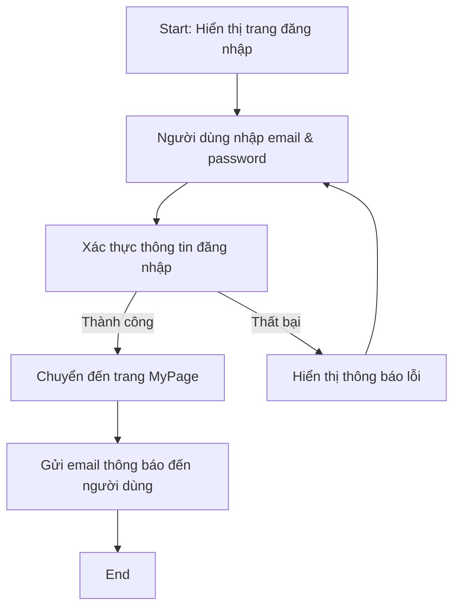
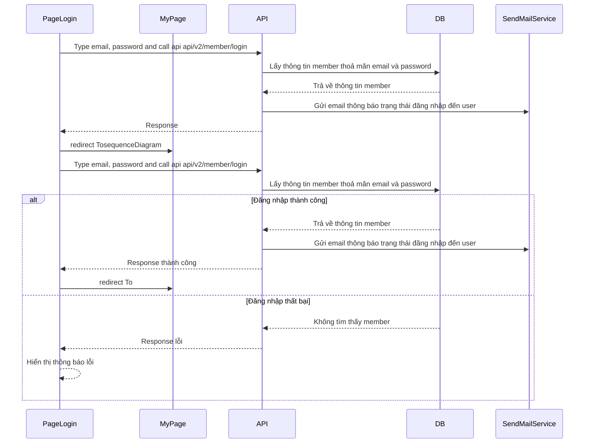

# 【Authen】Login
## 1. Mục đích
- Tính năng này nhằm cung cấp một trang đăng nhập có router là `/login` cho phép người dùng sử dụng tài khoản đã đăng kí trước đó để truy cập vào hệ thống.

## 2. Tổng quan chức năng

## 3. Nội dung thiết kế

### 3.1. Sơ đồ mô hình dữ liệu
- Dùng dữ liệu bảng members

### 3.2. Sơ đồ luồng xử lý

