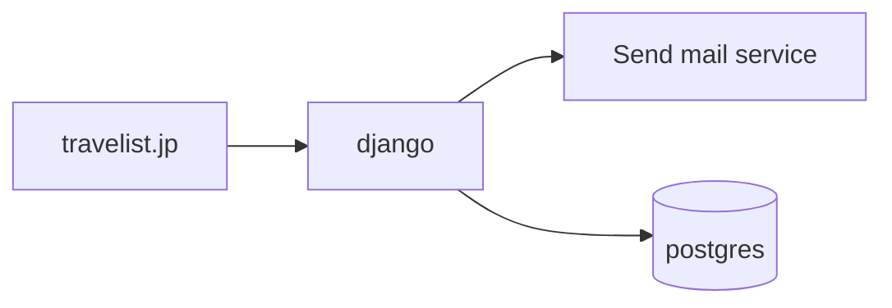
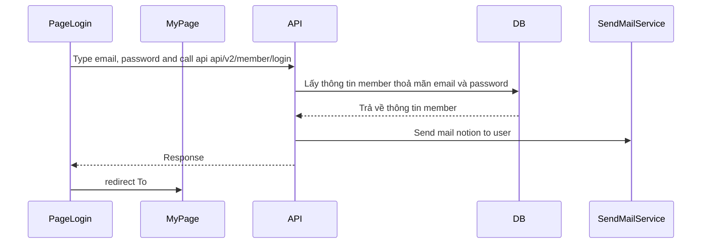

# 【Authen】Login
## 1. Mục đích
- Tính năng này nhằm cung cấp một trang đăng nhập có router là `/login` cho phép người dùng sử dụng tài khoản đã đăng kí trước đó để truy cập vào hệ thống.

## 2. Tổng quan chức năng
Trang đăng nhập cho phép người dùng nhập email và password để có thể vào hệ thống. Sau khi đăng nhập thành công sẽ được chuyển để màn hình mypage.

Các chức năng chính bao gồm:
- Giao diện đăng ký nhập, dễ sử dụng.
- Hiển thị thông báo lỗi chi tiết khi đăng nhập không thành công.
- Tự động đăng nhập và chuyển hướng người dùng đến trang mypage sau khi đăng nhập thành công.
- Send mail thông báo đến user.

## 3. Nội dung thiết kế

### 3.1. Kiến trúc tổng thể

### 3.2. Sơ đồ mô hình dữ liệu
- Dùng dữ liệu bảng members

### 3.3. Sơ đồ luồng xử lý

