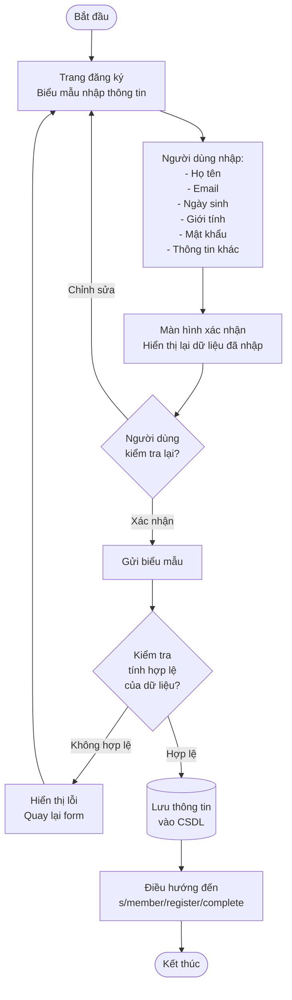
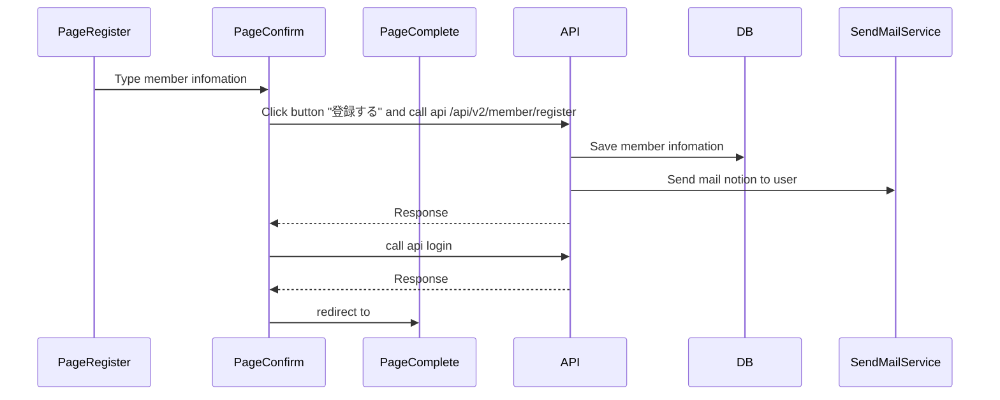

# 【Authen】Register
## 1. Mục đích
- Tính năng này nhằm cung cấp một trang đăng ký cho phép người dùng tạo tài khoản mới trên hệ thống. Trang đăng ký sẽ được truy cập thông qua router `/s/member/register`. Việc đăng ký tài khoản giúp người dùng có thể truy cập các chức năng dành riêng cho thành viên, quản lý thông tin cá nhân, và sử dụng các dịch vụ của hệ thống một cách đầy đủ.

## 2. Tổng quan chức năng

## 3. Nội dung thiết kế

### 3.1. Sơ đồ mô hình dữ liệu
- Bảng member trong schema airtown.jp

### 3.2. Sơ đồ luồng xử lý

