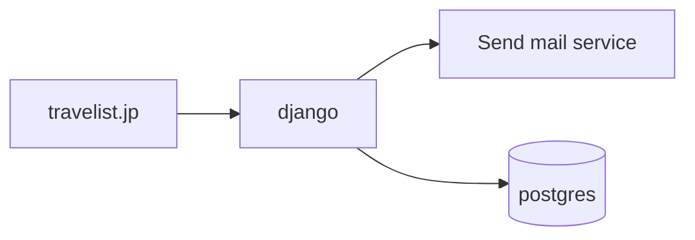
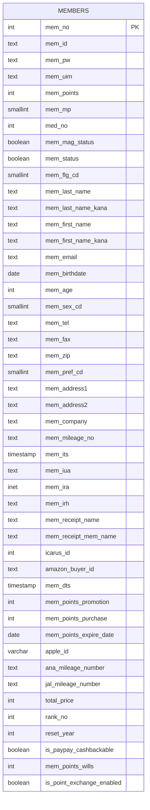
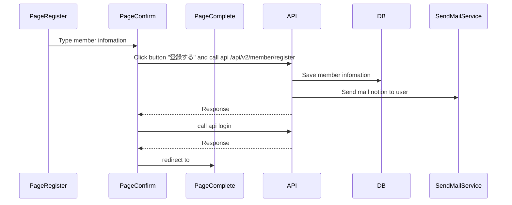

# 【Authen】Register
## 1. Mục đích
- Tính năng này nhằm cung cấp một trang đăng ký cho phép người dùng tạo tài khoản mới trên hệ thống. Trang đăng ký sẽ được truy cập thông qua router `/s/member/register`. Việc đăng ký tài khoản giúp người dùng có thể truy cập các chức năng dành riêng cho thành viên, quản lý thông tin cá nhân, và sử dụng các dịch vụ của hệ thống một cách đầy đủ.

## 2. Tổng quan chức năng
Trang đăng ký sẽ bao gồm một biểu mẫu cho phép người dùng nhập các thông tin cần thiết như: họ tên, địa chỉ email, ngày sinh, giới tính, mật khẩu, và các trường thông tin khác tùy thuộc vào yêu cầu của hệ thống. Sau khi hoàn thành những thông tin cần điền sẽ đến 1 màn hình confirm lại những dữ liệu đã nhập. Cuối cùng khi hoàn tất và gửi biểu mẫu, hệ thống sẽ thực hiện kiểm tra tính hợp lệ của dữ liệu, lưu thông tin người dùng vào cơ sở dữ liệu, và điều hướng người dùng đến trang `s/member/register/complete`.

Các chức năng chính bao gồm:
- Giao diện đăng ký đơn giản, dễ sử dụng.
- Xác thực dữ liệu đầu vào (kiểm tra định dạng email, độ dài mật khẩu, v.v.).
- Kiểm tra trùng lặp tài khoản (email đã tồn tại).
- Hiển thị thông báo lỗi chi tiết khi đăng ký không thành công.
- Tự động đăng nhập và chuyển hướng người dùng đến page complete sau khi đăng ký thành công.
- Send mail thông báo đến user.

## 3. Nội dung thiết kế
<!-- Ghi rõ phương châm thiết kế toàn hệ thống: chức năng sẽ được hiện thực theo cách nào -->
<!-- Nếu có thay đổi kiến trúc hoặc mô hình dữ liệu, đính kèm sơ đồ kiến trúc hoặc ER diagram -->

### 3.1. Kiến trúc tổng thể

### 3.2. Sơ đồ mô hình dữ liệu

### 3.3. Sơ đồ luồng xử lý

