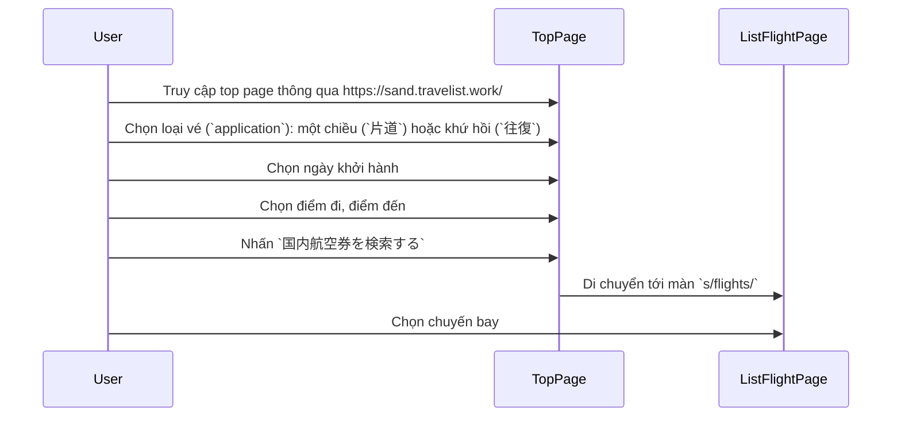
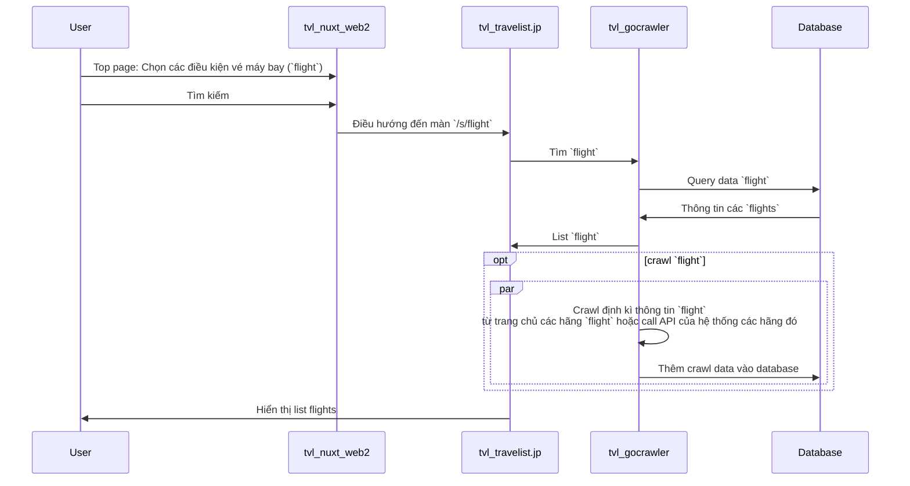

## Tổng quan
Tài liệu mô tả tổng quan về luồng search vé máy bay trên hệ thống Travelist

## Nội dung chính
### Repositories
- Giao diện:
  - https://github.com/apple-world/tvl_travelist.jp
  - https://github.com/apple-world/tvl_nuxt_web2

- Search vé máy bay:
  - https://github.com/apple-world/tvl_gocrawler

### Luồng đặt vé
- Luồng giao diện

- Giao diện:
  - Top page (URL: https://sand.travelist.work/):
  

  - List flight page (Ví dụ URL: https://sand.travelist.work/s/flights/20250602/20250610/CTS/KIX?mode=flight&room1=1):
  

### Luồng search vé tương ứng với các repositories

### Database
- Schema: `airtown.jp`.
- Lưu thông tin các `flight` đã crawl: bảng `domestic_flight_v2_crawlticket`
  - Khi crawl data `flight` định kì, các data mới sẽ tự động được thêm vào bảng này.

### API search vé
- Endpoint: 
  - https://sand.travelist.work/api/v1/search/flights/{departure_date}/{hãng bay}/{departure_airport}/{arrival_airport}
    - `departure_date`: Ngày khởi hành
    - `departure_airport`: điểm sân bay xuất phát
    - `arrival_airport`: điểm sân bay kết thúc
- Example: https://sand.travelist.work/api/v1/search/flights/20250602/ANA/CTS/KIX
- Code reference: [flight_search.go](https://github.com/apple-world/tvl_gocrawler/blob/163cbe7337582b0ca8d439d92b7c41596d1bb41b/handler/flight_search.go#L20-L168)

### Meta search
- Ngoài cách tìm kiếm vé trực tiếp trên hệ thống `Travelist`, các chuyến bay còn có thể được tìm kiếm thông qua các trang khác (`Skyscanner`, `Idou`, `Travelko`), được gọi là `meta search`. 
- Các bên thứ ba này sẽ gọi API meta search của hệ thống `Travelist` để lấy thông tin các chuyến bay và hiển thị.
- Các APIs search vé của bên `Travelist` cung cấp cho các bên thứ ba:

| Bên thứ ba | API Endpoint | Code Reference |
|----------|-------------|----------------|
| Skyscanner | https://sand.travelist.work/api/v1/search/flights_travelko/{depDate}/{airline}/{depAir}/{arrAir}/{travellerCnt}/{childCnt}/{infantCnt} | https://github.com/apple-world/tvl_gocrawler/blob/ec583f10aa446d5e6be2572100c33109d0538df5/handler/scanner_search.go#L28-L263 |
| Idou | https://sand.travelist.work/api/v1/search/flights_kakuyasuidou/{depDate}/{airline}/{depAir}/{arrAir}/{travellerCnt}/{childCnt}/{infantCnt} | https://github.com/apple-world/tvl_gocrawler/blob/df832b8df14bc06938dfa2e267e9ba7a066b68df/handler/kakuyasuidou_search.go#L23-L157|
| Travelko | https://sand.travelist.work/api/v1/search/flights_travelko/{depDate}/{airline}/{depAir}/{arrAir}/{travellerCnt}/{childCnt}/{infantCnt} | https://github.com/apple-world/tvl_gocrawler/blob/b36c89ee89a7a9e627fe9cd381e80decad75c98c/handler/travelko_search.go#L24-L176|
- Trong đó:
  - `depDate`: ngày khởi hành
  - `airline`: hãng bay
  - `depAir`: sân bay khởi hành
  - `arrAir`: sân bay điểm đến
  - `travellerCnt`, `childCnt`, `infantCnt`: Lần lượt là số hành khách là người lớn, trẻ em, trẻ sơ sinh
