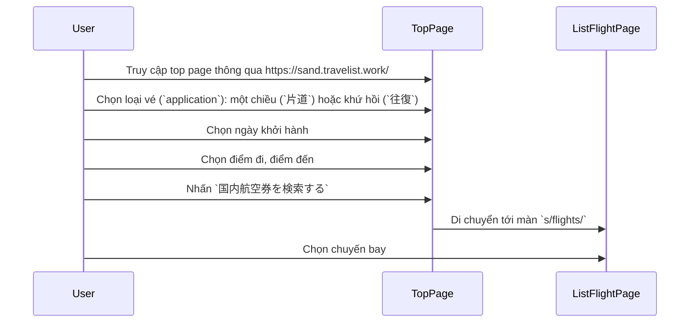
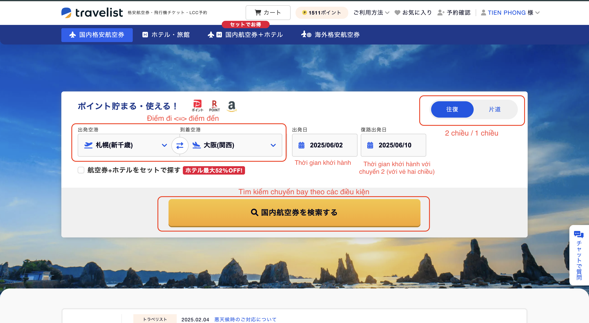
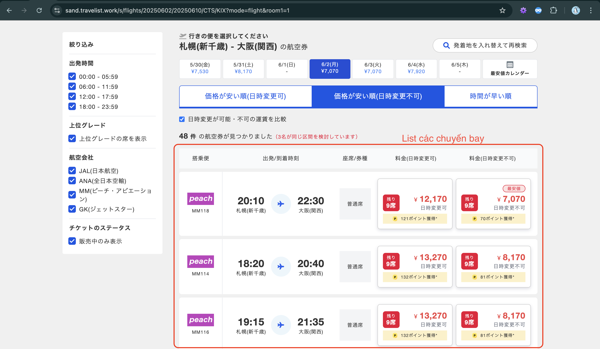
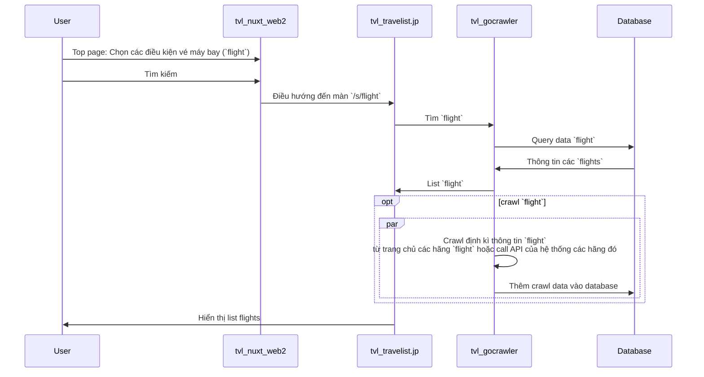

## Tổng quan
Tài liệu mô tả tổng quan về luồng search vé máy bay trên hệ thống Travelist

## Nội dung chính
### Repositories
- Giao diện:
  - https://github.com/apple-world/tvl_travelist.jp
  - https://github.com/apple-world/tvl_nuxt_web2

- Search vé máy bay:
  - https://github.com/apple-world/tvl_api_django
  - https://github.com/apple-world/tvl_gocrawler

### Luồng đặt vé
- Luồng giao diện

- Giao diện:
  - Top page (URL: https://sand.travelist.work/):
  

  - List flight page (Ví dụ URL: https://sand.travelist.work/s/flights/20250602/20250610/CTS/KIX?mode=flight&room1=1):
  

### Luồng search vé tương ứng với các repositories

### Database
- Schema: `airtown.jp`.
- Lưu thông tin các `flight` đã crawl: bảng `domestic_flight_v2_crawlticket`
  - Khi crawl data `flight` định kì, các data mới sẽ tự động được thêm vào bảng này.