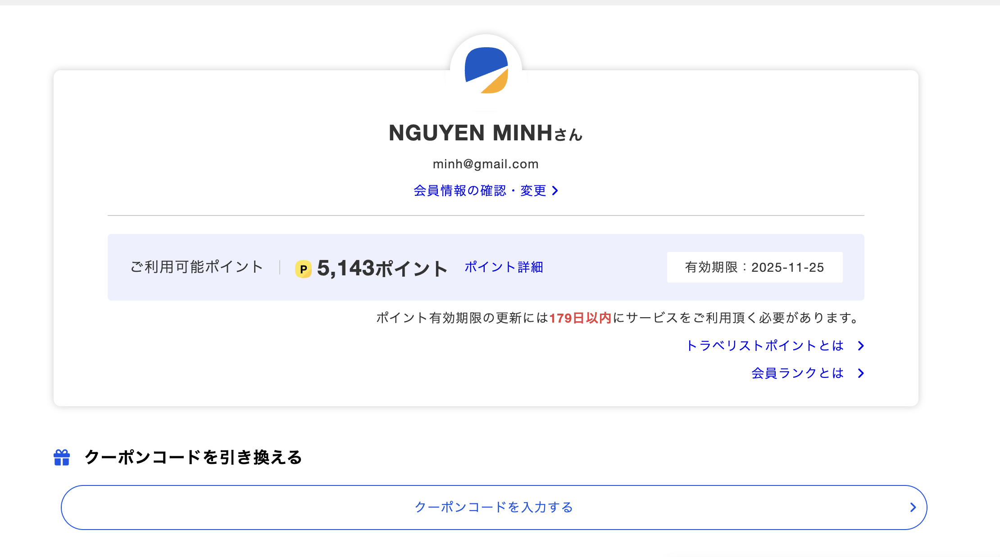
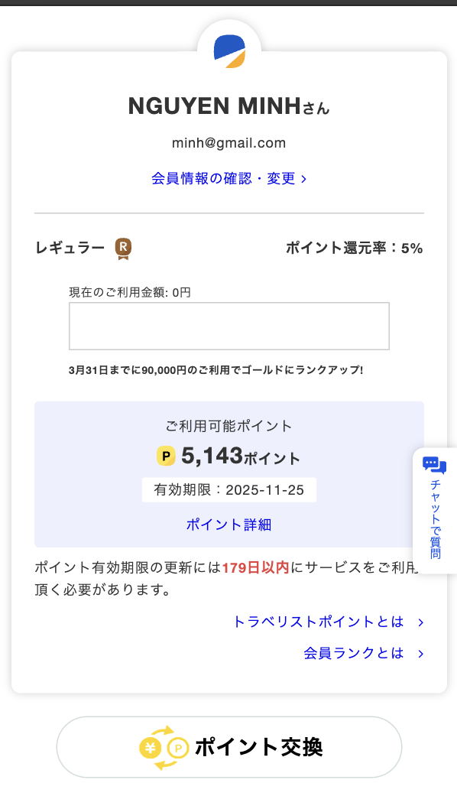

# Trang MyPage
## 1. Tổng quan
Trang `MyPage` cung cấp một cái nhìn tổng quát về thông tin người dùng và các chức năng liên quan đến việc quản lý tài khoản. Người dùng có thể truy cập và chỉnh sửa thông tin cá nhân, kiểm tra số `point`, hoặc thực hiện việc đổi `point`
- Note: Để truy cập trang mypage (`url`: https://sand.travelist.work/mypage/), người dùng cần đăng nhập vào tài khoản của mình.

## 2. Các chức năng chính
| Chức năng                                                                       | Web | App |
|---------------------------------------------------------------------------------|-----|-----|
| Hiển thị thông tin số point hiện có                                             | ✔️   | ✔️   |
| Hiển thị ngày hết hạn point                                                     | ✔️   | ✔️   |
| Chỉnh sửa thông tin cá nhân                                                     | ✔️   | ✔️   |
| Đổi `coupon code` thành `will point`                                            | ✔️   | ✔️   |
| Hiện thị `rank`                                                                 | ❌  | ✔️   |
| Đổi `point` từ travelist sang từ  `PayPay`, `Rakuten` hoặc `Amazon gift card`   | ❌  | ✔️   |

## 3. Giao diện
### 3.1. Web

### 3.1. APP

