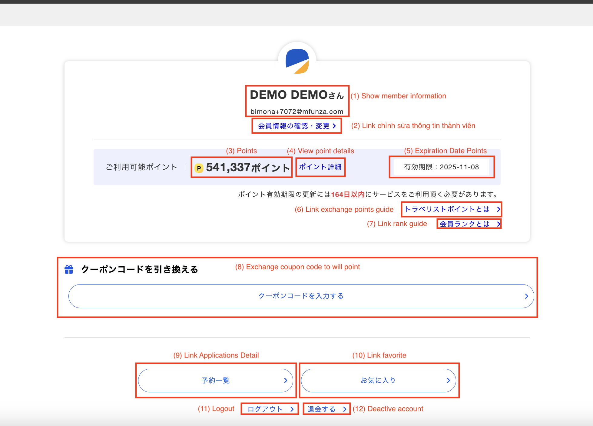
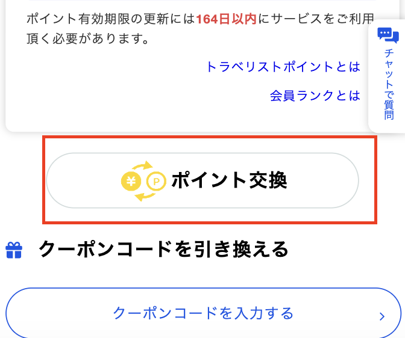
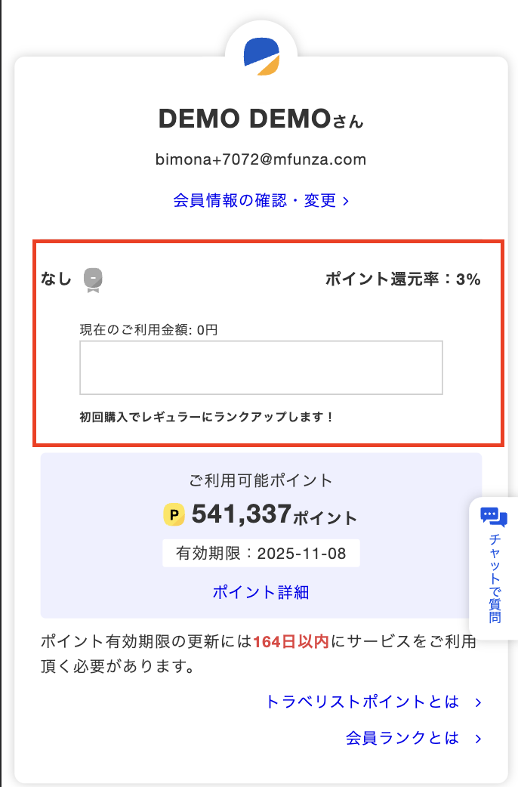

## Mô tả chức Năng Trang MyPage
### Flow trên WEB

- Giải thích:
    1. Hiện thị tên và email
    2. Hiện thị link chỉnh sửa thông tin thành viên (`会員情報の確認・変更`): Người dùng có thể cập nhật thông tin của mình
    3. Hiển Thị Số `Point` của người dùng (`ご利用可能ポイント`): Số điểm này có thể được sử dụng để đổi điểm hoặc mua hàng
    4. Hiện thị link chi tiết điểm (`ポイント詳細`): Cho phép người dùng xem các sự kiện liên quan tới sử dụng điểm
    5. Hiển Thị Ngày Hết Hạn Số `Point` (`有効期限`): Tính năng này cung cấp thông tin về ngày hết hạn của số điểm. Người dùng sẽ biết được thời gian còn lại để sử dụng điểm, giúp họ lên kế hoạch sử dụng hiệu quả hơn.
    6. Link hướng dẫn đổi `point`: Trang hướng dẫn người dùng sử dụng tính năng đổi `point`
    7. Link hướng dẫn `rank`: Trang hướng dẫn người dùng sử dụng tính năng `rank`
    8. Đổi `point` `coupon code` sang `will point`: Trang đổi mã giảm giá
    9. Hiện thị link Applications Detail (`予約一覧`): Chức năng này giúp người dùng dễ dàng truy cập vào màn hình chi tiết `booking`. Tại đây, người dùng có thể xem thông tin chi tiết các `booking`
    10. Hiện thị link màn Yêu Thích (`お気に入り`): Tính năng này cho phép người dùng lưu lại các hotel vào mục yêu thích
    11. Hiển thị link Logout (`ログアウト`): người dùng đăng xuất tài khoản của mình
    12. Hiển thị button hủy tư cách thành viên (`退会する`): cho phép người dùng hủy tư cách thành viên, nếu họ không còn muốn sử dụng dịch vụ của travelist

### Flow trên APP (IOS/Android)
- Tổng quan: Các chức năng trên website cũng được tích hợp đầy đủ trên ứng dụng. Bên cạnh đó, ứng dụng còn bổ sung một số tính năng khác, bao gồm hiển thị `rank` và cho phép người dùng chuyển đổi điểm từ Travelist sang bên `PayPay`, `Rakuten` hoặc `Amazon gift card`
- Chức năng đổi điểm:

Hiện thị button đổi điểm: để cho phép user có thể đổi `point` từ travelist sang `paypay`/`rakuten`/`amazon gift card`

- `Rank`:

Hiện thị level `rank` của người dùng: Cấp độ `Rank` được tính theo số tiền mua hàng của các booking bên `air` (chỉ tính các booking mua trên app native)
