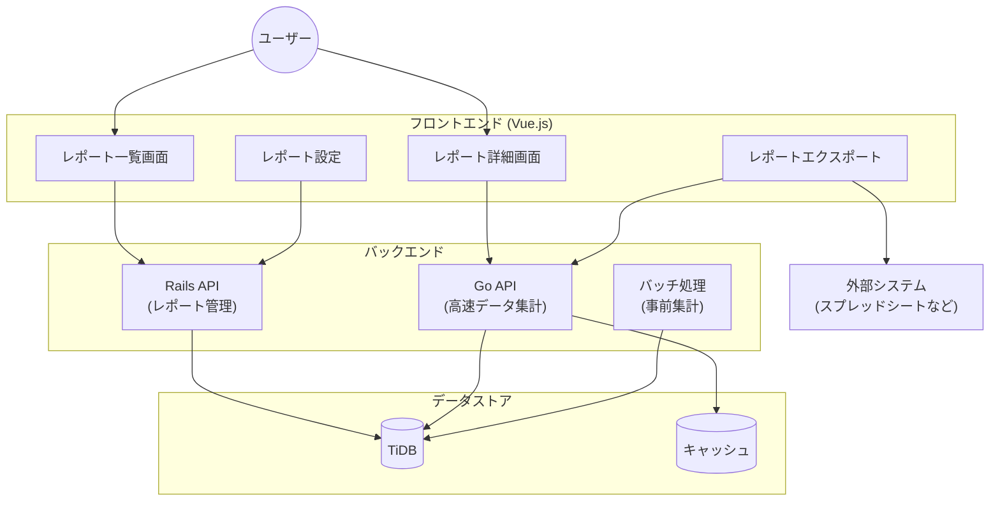
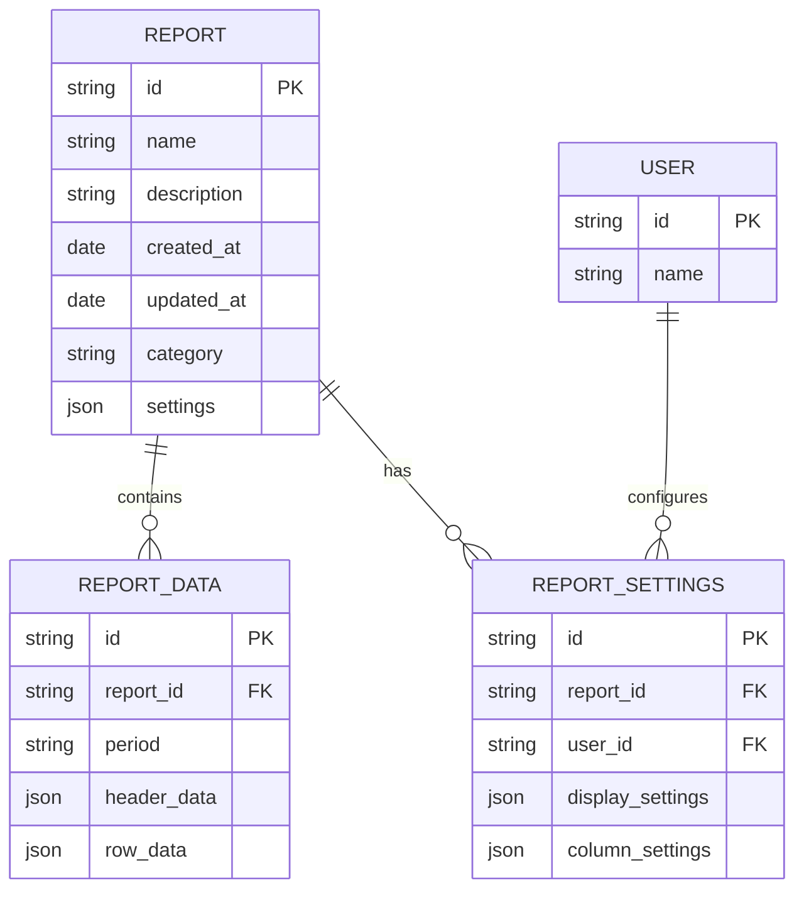
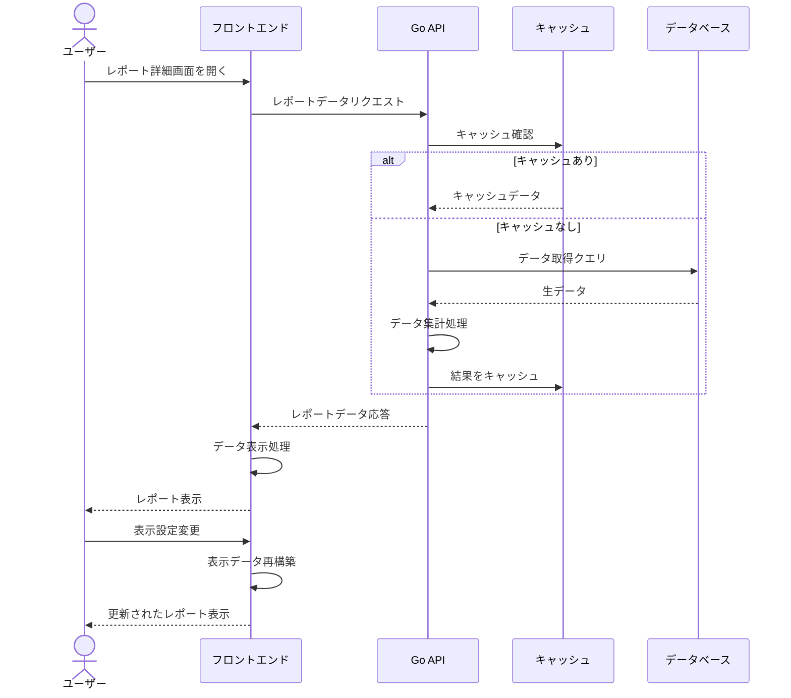
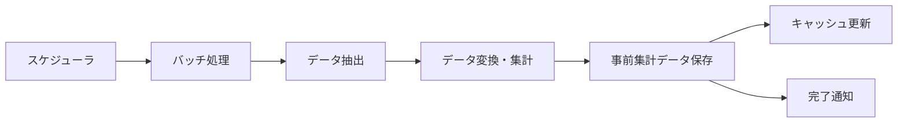

# dx-kpieeのレポート機能設計

このドキュメントでは、dx-kpieeにおけるレポート機能の設計と主要コンポーネントについて説明します。

## 1. 概要

dx-kpieeのレポート機能は、データの視覚化と分析を提供する中核機能です。フロントエンド（Vue.js）とバックエンド（Go API）から構成され、高性能なデータ処理と直感的なユーザーインターフェースを実現しています。

## 2. システムアーキテクチャ

レポート機能のシステムアーキテクチャは以下の通りです：

## 3. 主要コンポーネント

### 3.1 フロントエンドコンポーネント

#### レポート一覧画面
- 利用可能なレポートの一覧表示
- 検索・フィルタリング機能
- ソート機能
- ページネーション

#### レポート詳細画面
- テーブル形式でのデータ表示
- 表示設定の切り替え
- 期間表記の変更
- ドリルダウン機能
- カラム幅の調整
- 数値が入っていない行の非表示設定

#### レポート設定
- 表示形式の設定
- カスタムカラーの設定
- レポート全体へのメモ機能

#### レポートエクスポート
- CSVエクスポート
- スプレッドシートエクスポート

### 3.2 バックエンドコンポーネント

#### Rails API
- レポート管理（作成・更新・削除）
- ユーザー設定の管理
- データアクセス制御

#### Go API
- 高速データ集計処理
- 大量データの効率的な処理
- SQLクエリの最適化（NULL値のCOALESCE処理など）

#### バッチ処理
- 事前集計処理
- データキャッシュの更新
- 定期的なレポート生成

## 4. データモデル

レポート機能の主要なデータモデルは以下の通りです：

## 5. 処理フロー

### 5.1 レポートデータ取得フロー

### 5.2 バッチ処理フロー

## 6. 技術詳細

### 6.1 フロントエンド実装

- Vue.js + TypeScriptを使用したコンポーネントベースの実装
- 自動生成されたAPIクライアントを使用したバックエンドとの連携
- コンポーネントはStorybookでテスト可能

### 6.2 バックエンド実装

- Goによる高性能なデータ処理
  - スキーマファーストアプローチによるAPI設計
  - OpenAPI/Swaggerを使用した自動コード生成
  - NULL値をCOALESCEでゼロに変換する集計関数の実装

- Railsによるデータ管理
  - コードファーストアプローチによるAPI設計
  - rswagを使用したOpenAPI/Swaggerドキュメント自動生成

### 6.3 データ処理の最適化

- TiDBを活用した高速クエリ処理
- キャッシュ戦略によるレスポンス時間の短縮
- バッチ処理による事前集計

## 7. 将来の拡張性

- AI分析機能の統合
- より高度な可視化オプションの追加
- カスタムレポートビルダーの実装
- モバイルアプリとの連携強化
