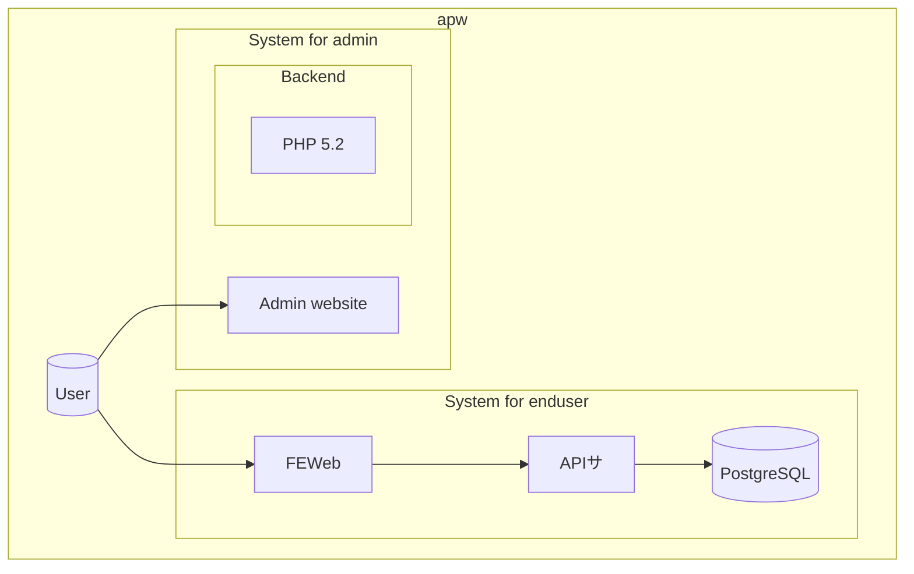

# Tổng quan kiến trúc hệ thống

ABC

## Toàn cảnh hệ thống

Về microservice

## Tổng quan chức năng dịch vụ

### tvl_travelist.jp

Cung cấp các chức năng chính sau:

- **Giao diện quản trị web**: Giao diện dành cho người dùng

## Công nghệ sử dụng

| Hạng mục | Công nghệ | Phiên bản |
|-----|------|----------|
| Frontend Framework | VueJS | xxxx |

### tvl_apl.travelonline.co.jp

Cung cấp các chức năng chính sau:

- **Giao diện quản trị web**: Giao diện dành cho người quản trị viên

## Công nghệ sử dụng

| Hạng mục | Công nghệ | Phiên bản |
|-----|------|----------|
| Backend | PHP | 5.2 |

