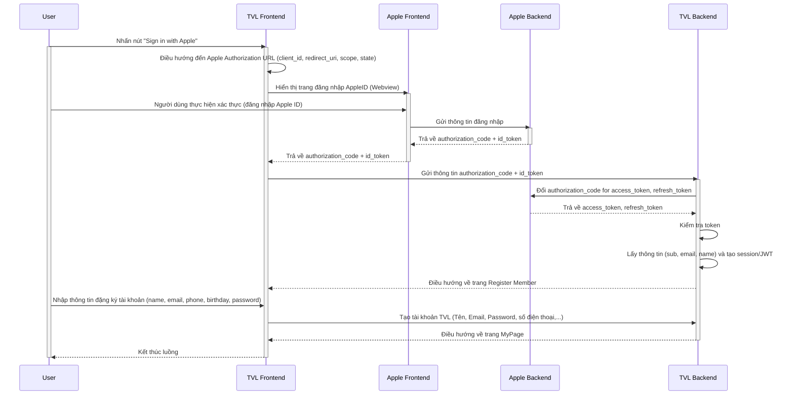

```yaml
 Tiêu đề: Tích hợp chức năng đăng nhập bằng Apple ID trên Web Frontend.
 Mô tả: Tài liệu này hướng dẫn quy trình tích hợp và triển khai "Sign in with Apple" cho ứng dụng Web Frontend, bao gồm các yêu cầu kỹ thuật và các bước xử lý chi tiết trên môi trường Sandbox và Production.

 tags:
  - type:doc
  - feature:points_exchange/apple/login
  - domain:shared
  - created_by: nhuthq@zigexn.vn
  - created_at: 2025-04-28
----
```

## Purpose:

- Tài liệu này mô tả cách tích hợp và triển khai chức năng "Sign in with Apple" cho ứng dụng Web (Front-End trên Safari) trong cả môi trường Sandbox và Production.
- Mục tiêu nhằm chuẩn hóa quy trình đăng nhập người dùng bằng tài khoản Apple, lấy thông tin người dùng cần thiết, và gọi các API nội bộ xử lý xác thực.

## Overview:

- Platform:
  - TVL Web: Safari SP
  - TVP App: iOS
- Environment: Sandbox, Production
- Authentication Method: OAuth 2.0 + OpenID Connect
- Apple Services:
  - Authorization Endpoint
  - Token Endpoint
  - Public Key Endpoint (để xác thực ID Token)
- Sau khi người dùng đăng nhập thành công thông qua giao diện Apple, Apple sẽ trả về một Authorization Code và ID Token.

  - Ứng dụng sẽ: - Gửi Authorization Code tới server backend để xác thực và lấy Access Token / Refresh Token (nếu cần).
  - Trích xuất thông tin user từ ID Token (JWT).

- Thông tin user mà Apple cung cấp:
  | Thông tin | Mô tả |
  | ---------------------- |---------------------------------------------------------- |
  | `email` | Email của người dùng |
  | `sub` | Định danh duy nhất của người dùng (user identifier) |
  | `name (optional)` | Họ tên người dùng (chỉ cung cấp lần đầu tiên đăng nhập) |
  | `email_verified` | Email đã được xác minh hay chưa |

## Flow:

- Luồng xử lý chính bao gồm các bước sau:

  - **Bước 1:** Người dùng nhấn "Sign in with Apple" trên trang Web.

  - **Bước 2:** TVL Frontend tạo URL để chuyển hướng người dùng đến Apple Authorization Endpoint. Địa chỉ này chứa các tham số như client_id, redirect_uri, scope, state, và response_mode.

  - **Bước 3:** Apple Frontend hiển thị giao diện xác thực, nơi người dùng có thể đăng nhập và đồng ý cấp quyền truy cập (ví dụ: email và tên).

  - **Bước 4:** Người dùng thực hiện xác thực (đăng nhập Apple ID) và cấp quyền cho ứng dụng (cho phép chia sẻ thông tin như email, tên).

  - **Bước 5:** Sau khi xác thực thành công, Apple Frontend sẽ redirect người dùng trở lại TVL Frontend kèm theo các thông tin cần thiết: authorization_code và id_token.

  - **Bước 6:** TVL Frontend gửi Authorization Code và ID Token đã nhận từ Apple đến TVL Backend để xác thực và lấy Access Token.

  - **Bước 7:** TVL Backend gửi Authorization Code tới Apple Authorization Server để đổi lấy Access Token và Refresh Token (nếu có).

  - **Bước 8:** Apple Backend trả về Access Token và Refresh Token sau khi Authorization Code được xác thực.

  - **Bước 9:** TVL Backend tiến hành xác thực ID Token bằng cách kiểm tra chữ ký và các thông tin claims như aud, iss, exp, sub.

  - **Bước 10:** TVL Backend trích xuất thông tin người dùng từ ID Token (chẳng hạn sub, email, name) và lưu trữ trong hệ thống để tạo session hoặc JWT cho người dùng.

  - **Bước 11:** TVL Backend trả lại Access Token cho TVL Frontend để sử dụng trong các lần gọi API sau.

  - **Bước 12:** TVL Frontend điều hướng user đến trang đăng ký tài khoản TVL.

  - **Bước 13:** User cập nhật thông tin đăng ký bao gồm (Tên, email, số điện thoại, ngày tháng năm sinh, mật khẩu), để hoàn tất việc tạo tài khoản.

  - **Bước 14:** Khởi tạo tài khoản TVL, sau đó điều hướng người dùng về trang MyPage.

  - Các chú thích bổ sung:
    | Thông tin | Mô tả |
    | ---------------------- |---------------------------------------------------------- |
    | `Bước 2` | TVL Frontend phải tự build URL OAuth 2.0 chuẩn và redirect người dùng đến Apple Authorization Endpoint. |
    | `Bước 5` | Sau khi user cấp quyền, Apple Frontend redirect ngược về redirect_uri của TVL với authorization_code và id_token. |
    | `Bước 7` | TVL Backend cần có client_secret (Apple yêu cầu ký bằng private key) để thực hiện exchange authorization_code. |
    | `Bước 9` | TVL Backend xác thực ID Token rất quan trọng để tránh giả mạo (check signature, issuer, audience). |
    | `Bước 12` | Điều hướng user đến form đăng ký vì Sign in with Apple chỉ cung cấp tối thiểu thông tin (email, name). |



- Thông tin các actors:
  | Thông tin | Mô tả |
  | ---------------------- |---------------------------------------------------------- |
  | `User` | Người dùng tương tác với hệ thống. |
  | `TVL Frontend` | Web frontend của hệ thống TVL, giao diện hiển thị và xử lý tương tác người dùng. |
  | `Apple Frontend` | Giao diện Apple hiển thị login và cấp quyền cho user. |
  | `Apple Backend` | Server của Apple xử lý xác thực, cấp Authorization Code và Access Token. |
  | `TVL Backend` | Server backend của hệ thống TVL, nhận và xác thực Authorization Code, tạo tài khoản, quản lý session. |

- Chú thích vai trò:

  - Apple Frontend và Apple Backend tách biệt:
    - Apple Frontend: nơi user nhìn thấy giao diện login.
    - Apple Backend: nơi server Apple xác thực mã và cấp token.
  - TVL Frontend chịu trách nhiệm:
    - Redirect đúng Apple.
    - Nhận kết quả.
    - Đẩy authorization code cho TVL Backend.
  - TVL Backend chịu trách nhiệm:
    - Đổi authorization_code lấy access_token.
    - Validate ID Token.
    - Lưu thông tin user + session.
    - Trả kết quả về cho TVL Frontend.

## API:

- **PayPay**
  | Endpoint | Method | Description |
  | ---------------------- | ------ | ---------------------------------------------------------- |
  | `https://appleid.apple.com/auth/authorize` | GET | Khởi tạo luồng đăng nhập Apple, redirect đến URL xác thực. |
  | `/api/v1/auth/apple/login` | POST | Nhận Authorization Code & ID Token từ Frontend, xác thực với Apple server. |
