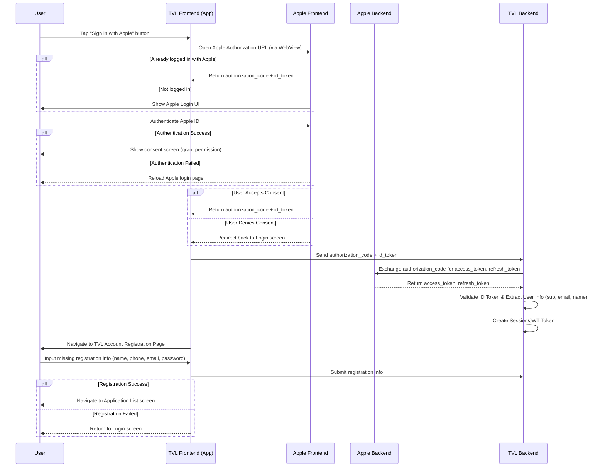

```yaml
 Tiêu đề: Tích hợp chức năng đăng nhập bằng Apple ID trên TVL App.
 Mô tả: Tài liệu này hướng dẫn quy trình tích hợp và triển khai "Sign in with Apple" cho ứng dụng TVL, bao gồm các yêu cầu kỹ thuật và các bước xử lý chi tiết trên môi trường Sandbox và Production.

 tags:
  - type:doc
  - feature:authentication/apple/login
  - domain:mobile
  - created_by: nhuthq@zigexn.vn
  - created_at: 2025-04-28
----
```

## Purpose:

- Tài liệu này mô tả cách tích hợp và triển khai chức năng "Sign in with Apple" cho ứng dụng TVL trên môi trường Sandbox và Production.
- Mục tiêu nhằm chuẩn hóa quy trình đăng nhập người dùng bằng tài khoản Apple, lấy thông tin người dùng cần thiết, và gọi các API nội bộ xử lý xác thực.

## Overview:

- Nền tảng:
  - TVL App: iOS
- Môi trường: Sandbox, Production
- Phương thức xác thực: OAuth 2.0 + OpenID Connect

- Thông tin user mà Apple cung cấp:
  | Thông tin | Mô tả |
  | ---------------------- |---------------------------------------------------------- |
  | `email` | Email của người dùng |
  | `sub` | Định danh duy nhất của người dùng (user identifier) |
  | `name (optional)` | Họ tên người dùng (chỉ cung cấp lần đầu tiên đăng nhập) |
  | `email_verified` | Email đã được xác minh hay chưa |

## Flow:

- Luồng xử lý chính bao gồm các bước sau:

  - **Bước 1:** Người dùng nhấn "Sign in with Apple" ở màn hình đăng nhập trên TVL App.

  - **Bước 2:** TVL Frontend chuyển hướng người dùng đến Apple Authorization Endpoint bằng WebView. Địa chỉ này chứa các tham số như client_id, redirect_uri, scope, state, và response_mode.

  - **Bước 3:**

    - Nếu đã đăng nhập trước đó: Apple thực hiện việc việc cấp authorization_code và id_token về cho TVL Frontend.
    - Nếu chưa đăng nhập: Apple hiển thị giao diện xác thực, nơi người dùng có thể đăng nhập và đồng ý cấp quyền truy cập (ví dụ: email và tên).

  - **Bước 4:** Người dùng thực hiện xác thực (đăng nhập Apple ID).

    - Nếu xác thực thành công: Hiển thị màn hình xin quyền đăng nhập thông qua TVL
    - Nếu xác thực thất bại: Hiển thị lại trang Login Apple để thực hiện tại việc đăng nhập

  - **Bước 5:** Yêu cầu người dùng xác nhận và cấp quyền cho ứng dụng.

    - Nếu chấp nhận: Apple thực hiện việc việc cấp authorization_code và id_token về cho TVL Frontend.
    - Nếu từ chối: Trở về màn hình TVL Login, kết thúc luồng.

  - **Bước 6:** TVL Frontend gửi authorization_code và id_token về TVL Backend

  - **Bước 7:** TVL Backend gửi Authorization Code tới Apple Authorization Server để đổi lấy Access Token và Refresh Token (nếu có).

  - **Bước 8:** Apple trả về Access Token và Refresh Token sau khi Authorization Code được xác thực.

  - **Bước 9:** TVL Frontend trích xuất thông tin người (sub, email, name) và lưu trữ trong hệ thống để tạo session hoặc JWT cho người dùng.

  - **Bước 10:** TVL Frontend điều hướng đến trang đăng ký tài khoản TVL.

  - **Bước 11:** Người dùng điền thông tin đăng ký (Tên, số điện thoại, email, passwords), các thông tin còn thiếu.

  - **Bước 12:** TVL Frontend gửi thông tin đăng ký tài khoản về TVL Backend

  - **Bước 12:** Chuyển hướng sau khi tạo thông tin tài khoản TVL.

    - Nếu tạo tài khoản thành công: Chuyển đến màn hình Application List.
    - Nếu tạo tài khoản thất bại: Kết thúc luồng, quay về màn hình Login.

  - **Bước 13:** Kết thúc luồng xử lý

  - Các chú thích bổ sung:
    | Thông tin | Mô tả |
    | ---------------------- |---------------------------------------------------------- |
    | `Bước 2` | TVL Frontend phải tự build URL OAuth 2.0 chuẩn và redirect người dùng đến Apple Authorization Endpoint. |
    | `Bước 5` | Sau khi user cấp quyền, Apple Frontend redirect ngược về redirect_uri của TVL với authorization_code và id_token. |
    | `Bước 7` | TVL Backend cần có client_secret (Apple yêu cầu ký bằng private key) để thực hiện exchange authorization_code. |
    | `Bước 8` | TVL Backend xác thực ID Token rất quan trọng để tránh giả mạo (check signature, issuer, audience). |
    | `Bước 12` | Điều hướng user đến form đăng ký vì Sign in with Apple chỉ cung cấp tối thiểu thông tin (email, name). |



- Thông tin các actors:
  | Thông tin | Mô tả |
  | ---------------------- |---------------------------------------------------------- |
  | `User` | Người dùng tương tác với hệ thống. |
  | `TVL Frontend` | Web frontend của hệ thống TVL, giao diện hiển thị và xử lý tương tác người dùng. |
  | `TVL Backend` | Server backend của hệ thống TVL, nhận và xác thực Authorization Code, tạo tài khoản, quản lý session. |
  | `Apple ` | Bao gồm chung phần Frontend và Backend. |

- Chú thích vai trò:

  - Apple bao gồm phần Frontend và Backend:
    - Apple Frontend: nơi user nhìn thấy giao diện login và xử lý xác thực mã và cấp token.
  - TVL Frontend chịu trách nhiệm:
    - Redirect đúng Apple.
    - Nhận kết quả.
    - Đẩy authorization code cho TVL Backend.
  - TVL Backend chịu trách nhiệm:
    - Đổi authorization_code lấy access_token.
    - Validate ID Token.
    - Lưu thông tin user + session.
    - Trả kết quả về cho TVL Frontend.

## API:

| Endpoint                                   | Method | Description                                                                |
| ------------------------------------------ | ------ | -------------------------------------------------------------------------- |
| `https://appleid.apple.com/auth/authorize` | GET    | Khởi tạo luồng đăng nhập Apple, redirect đến URL xác thực.                 |
| `/api/v1/auth/apple/login`                 | POST   | Nhận Authorization Code & ID Token từ Frontend, xác thực với Apple server. |

- Apple Services:
  | Dịch vụ | Vai trò | URL
  | ---------------------- | ---------------------------------------------------------- | ---------------------------------------------------------- |
  | `Authorization Endpoint` | Dùng để redirect người dùng đến trang đăng nhập Apple ID và cấp quyền. | https://appleid.apple.com/auth/authorize
  | `Token Endpoint` | Dùng để backend của bạn đổi Authorization Code lấy Access Token và ID Token. | https://appleid.apple.com/auth/token
  | `Public Keys Endpoint` | Cung cấp public keys để bạn kiểm tra chữ ký (signature) của ID Token. | https://appleid.apple.com/auth/keys
