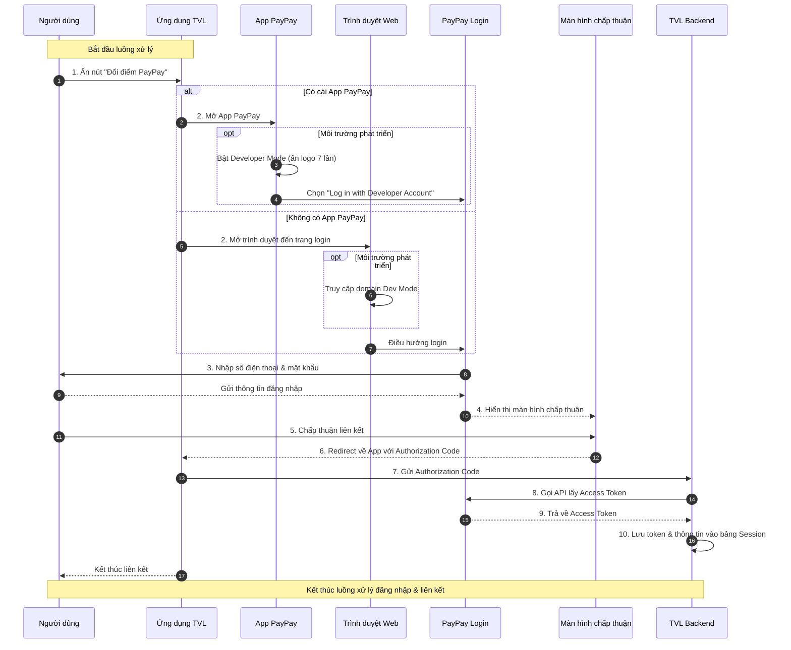

```yaml
 Tiêu đề: Tài liệu kỹ thuật về luồng đăng nhập qua PayPay trên ứng dụng TVL (iOS & Android)
 Mô tả: Tài liệu này trình bày chi tiết luồng xử lý đăng nhập vào tài khoản PayPay từ ứng ứng dụng TVL (iOS & Android) nhằm phục vụ việc liên kết tài khoản TVL và PayPay thông qua ứng dụng PayPay hoặc trình duyệt. Đồng thời mô tả cách bật Developer Mode để phục vụ môi trường kiểm thử.

 tags:
  - type:doc
  - feature:points_exchange/paypay/login
  - domain:mobile
  - created_by: nhuthq@zigexn.vn
  - created_at: 2025-04-25
----
```

## Purpose:

- Tài liệu này nhằm mục đích cung cấp mô tả kỹ thuật chi tiết liên quan đến quá trình đăng nhập tài khoản PayPay trên **ứng dụng TVL** (iOS & Android) – một bước trung gian quan trọng trong quá trình liên kết tài khoản giữa TVL App và PayPay, từ đó cho phép người dùng thực hiện tính năng chuyển đổi điểm.

## Overview:

- Việc đăng nhập PayPay là bước trung gian quan trọng trước khi người dùng có thể thực hiện chuyển đổi điểm từ **ứng dụng TVL** (iOS & Android) sang ví PayPay, và đảm bảo rằng các tài khoản được liên kết một cách an toàn và hợp lệ.
- Mục tiêu:
  - Cho phép người dùng đăng nhập vào tài khoản PayPay của họ để thực hiện liên kết với tài khoản TVL.
  - Hỗ trợ chế độ phát triển (Developer Mode) dành cho môi trường kiểm thử.
- Điều kiện:
  - Người dùng phải có tài khoản TVL và tài khoản PayPay đã được tạo sẵn từ trước.
- Nền tảng:
  - Ứng dụng TVL (iOS, Android)
  - Ứng dụng PayPay (iOS, Android)
  - Trình duyệt Web (trong trường hợp không cài PayPay App)
- Người dùng có thể thực hiện login vào PayPay qua hai hình thức tùy theo thiết bị:
  - **App PayPay (nếu đã cài)**: Mở app PayPay để đăng nhập và chấp thuận liên kết.
  - **Browser (nếu không cài app PayPay)**: Điều hướng đến trình duyệt để đăng nhập và thực hiện liên kết.

## Flow:

- Luồng xử lý chính bao gồm các bước sau:
- **Bước 1** Người dùng mở ứng dụng TVL và nhấn nút "Đổi điểm PayPay" từ màn hình MyPage.
- **Bước 2** Ứng dụng TVL kiểm tra nếu thiết bị có cài đặt App PayPay:
  - Nếu có App PayPay:
    - App TVL mở ứng dụng PayPay thông qua URL scheme.
    - Trong môi trường phát triển, người dùng cần ấn 7 lần vào logo để bật Developer Mode.
    - Người dùng chọn “Log in with Developer Account” (nếu có).
  - Nếu không có App PayPay:
    - Ứng dụng TVL mở trình duyệt mặc định, điều hướng đến trang đăng nhập của PayPay.
    - Trong môi trường phát triển, người dùng sẽ được điều hướng tới domain sandbox (https://stg-www.sandbox.paypay.ne.jp/).
- **Bước 3** Người dùng nhập số điện thoại và mật khẩu của tài khoản PayPay.
- **Bước 4** Sau khi xác thực thành công, PayPay hiển thị màn hình chấp thuận liên kết tài khoản.
- **Bước 5** Người dùng nhấn chấp thuận, hệ thống PayPay redirect về lại ứng dụng TVL (deep link hoặc universal link), kèm theo authorization code.
- **Bước 6** Ứng dụng TVL nhận code và gửi code này về TVL Backend để xử lý.
- **Bước 7** TVL Backend gọi API của PayPay để đổi code lấy access token và thông tin người dùng.
- **Bước 8** Sau khi nhận được access token, hệ thống sẽ lưu thông tin đăng nhập PayPay vào bảng Session.
- **Bước 9** Ứng dụng TVL cập nhật trạng thái liên kết thành công và thông báo cho người dùng.



- TVL Backend giờ đóng vai trò:
  - Nhận callback từ PayPay chứa authorization code.
  - Gọi PayPay token API để đổi lấy access token và thông tin người dùng.
  - Lưu thông tin vào bảng Session để đánh dấu trạng thái login.
  - Trả kết quả về lại frontend.

## API:

| Endpoint               | Method | Description                                                |
| ---------------------- | ------ | ---------------------------------------------------------- |
| `/paypay/authorize`    | GET    | Khởi tạo luồng đăng nhập PayPay, redirect đến URL xác thực |
| `/paypay/callback`     | POST   | Nhận callback từ PayPay sau khi người dùng xác thực        |
| `/paypay/token`        | POST   | Đổi authorization code lấy access token từ PayPay          |
| `/paypay/link-account` | POST   | Lưu thông tin tài khoản PayPay vào bảng Session của TVL    |

- **Lưu ý:** Trong luồng đăng nhập PayPay, không có API từ phía TVL trực tiếp xử lý việc login, vì tất cả việc xác thực đều thực hiện trên nền tảng PayPay. Tuy nhiên, một số thông tin kỹ thuật liên quan có thể được sử dụng từ tài liệu chính thức của PayPay:
  | Thông tin | Mô tả |
  |----------------------------|----------------------------------------------------------------------|
  | **URL môi trường Production** | `https://www.paypay.ne.jp/opa/authorize` |
  | **URL môi trường Sandbox** | `https://stg-www.sandbox.paypay.ne.jp/` |
  | **Tài liệu chính thức** | [PayPay Official Docs](https://www.paypay.ne.jp/opa/doc/v1.0/account_link.html#section/Acquire-user-authorization) |
  | **OAuth Flow** | Authorization Code Grant |

- Developer Mode:
  | Nền tảng | Cách bật chế độ |
  |---------------------|----------------------------------------------------------------------------------|
  | **Ứng dụng PayPay** | Ấn 7 lần vào logo PayPay ở góc trái màn hình đăng nhập. Chọn `Log in with PayPay for Developers account`. |
  | **Trình duyệt Web** | Truy cập vào liên kết: `https://stg-www.sandbox.paypay.ne.jp/` |
