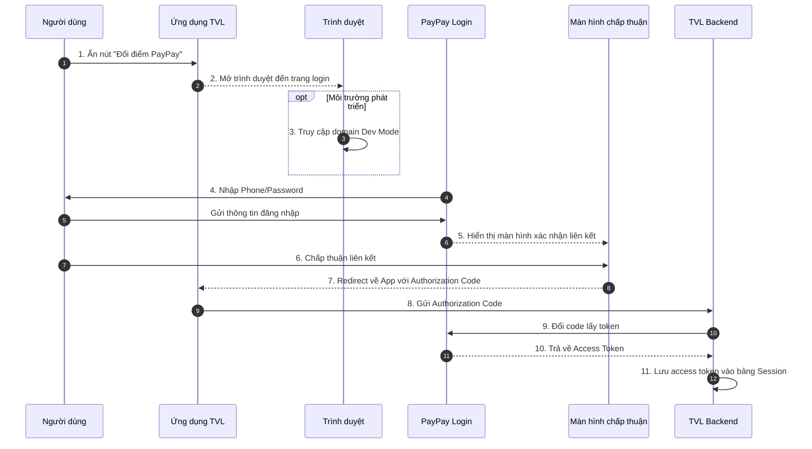

```yaml
 Tiêu đề: Tài liệu kỹ thuật về luồng đăng nhập qua PayPay trên ứng dụng TVL (iOS & Android)
 Mô tả: Tài liệu này trình bày chi tiết luồng xử lý đăng nhập vào tài khoản PayPay từ ứng ứng dụng TVL (iOS & Android) nhằm phục vụ việc liên kết tài khoản TVL và PayPay thông qua ứng dụng PayPay hoặc trình duyệt. Đồng thời mô tả cách bật Developer Mode để phục vụ môi trường kiểm thử.

 tags:
  - type:doc
  - feature:points_exchange/paypay/login
  - domain:mobile
  - created_by: nhuthq@zigexn.vn
  - created_at: 2025-04-25
----
```

## Purpose:

- Tài liệu này nhằm mục đích cung cấp mô tả kỹ thuật chi tiết liên quan đến quá trình đăng nhập tài khoản PayPay trên **ứng dụng TVL** (iOS & Android) – một bước trung gian quan trọng trong quá trình liên kết tài khoản giữa TVL App và PayPay, từ đó cho phép người dùng thực hiện tính năng chuyển đổi điểm.

## Overview:

- Việc đăng nhập PayPay là bước trung gian quan trọng trước khi người dùng có thể thực hiện chuyển đổi điểm từ **ứng dụng TVL** (iOS & Android) sang ví PayPay, và đảm bảo rằng các tài khoản được liên kết một cách an toàn và hợp lệ.
- Mục tiêu:
  - Cho phép người dùng đăng nhập vào tài khoản PayPay của họ để thực hiện liên kết với tài khoản TVL.
  - Hỗ trợ chế độ phát triển (Developer Mode) dành cho môi trường kiểm thử.
- Điều kiện:
  - Người dùng phải có tài khoản TVL và tài khoản PayPay đã được tạo sẵn từ trước.
- Nền tảng:
  - Ứng dụng TVL (iOS, Android)
  - Ứng dụng PayPay (iOS, Android)
  - Trình duyệt Web (trong trường hợp không cài PayPay App)
- Người dùng có thể thực hiện login vào PayPay qua hai hình thức tùy theo thiết bị:
  - **App PayPay (nếu đã cài)**: Mở app PayPay để đăng nhập và chấp thuận liên kết.
  - **Browser (nếu không cài app PayPay)**: Điều hướng đến trình duyệt để đăng nhập và thực hiện liên kết.

## Flow:

- Luồng xử lý chính bao gồm các bước sau:

**Trường hợp 1: Thiết bị có cài App PayPay**

- **Bước 1** Người dùng ấn nút "Đổi điểm PayPay" trên trang MyPage của ứng dụng TVL.
- **Bước 2** Ứng dụng mở App PayPay.
- **Bước 3** Trong App PayPay:
  - Nếu là môi trường phát triển: người dùng ấn logo PayPay 7 lần để bật Developer Mode.
  - Chọn **"Log in with PayPay for Developers account"** (nếu áp dụng).
- **Bước 4** Nhập số điện thoại và mật khẩu.
- **Bước 5** Đăng nhập thành công, app tự động chuyển đến màn hình chấp thuận liên kết tài khoản.

- **Bước 6** Sau khi chấp thuận, hệ thống PayPay redirect ngược về TVL App, kèm theo authorization code.
- **Bước 7** TVL Backend xử lý:

  - Gửi code để lấy access token.
  - Lưu access token & info vào bảng `Session`.

  ```mermaid
  sequenceDiagram
    autonumber
    participant User as Người dùng
    participant TVLApp as Ứng dụng TVL
    participant PayPayApp as App PayPay
    participant PayPayLogin as PayPay Login
    participant Consent as Màn hình chấp thuận
    participant TVLBE as TVL Backend

    User->>TVLApp: 1. Ấn nút "Đổi điểm PayPay"
    TVLApp-->>PayPayApp: 2. Mở App PayPay
    opt Môi trường phát triển
        PayPayApp->>PayPayApp: 3. Ấn logo 7 lần để bật Dev Mode
        PayPayApp->>PayPayLogin: 4. Chọn "Log in with Developer Account"
    end
    PayPayLogin->>User: 5. Nhập Phone/Password
    User->>PayPayLogin: Gửi thông tin đăng nhập
    PayPayLogin-->>Consent: 6. Chuyển đến màn hình xác nhận liên kết
    User->>Consent: 7. Chấp thuận liên kết
    Consent-->>TVLApp: 8. Redirect kèm Authorization Code
    TVLApp->>TVLBE: 9. Gửi Authorization Code
    TVLBE->>PayPayLogin: 10. Đổi token từ PayPay
    PayPayLogin-->>TVLBE: 11. Trả về Access Token
    TVLBE->>TVLBE: 12. Lưu access token vào bảng Session
  ```

**Trường hợp 2: Thiết bị KHÔNG có cài App PayPay**

- **Bước 1** Người dùng ấn nút "Đổi điểm PayPay" trên MyPage.
- **Bước 2** Ứng dụng mở trình duyệt web đến trang đăng nhập PayPay.
- **Bước 3** Nếu là môi trường phát triển:
  - Truy cập domain `https://stg-www.sandbox.paypay.ne.jp/` (Developer Mode).
- **Bước 4** Người dùng đăng nhập bằng tài khoản PayPay.
- **Bước 5** Sau khi xác thực, redirect về ứng dụng TVL với authorization code.
- **Bước 6** TVL Backend thực hiện tương tự:



- TVL Backend giờ đóng vai trò:
  - Nhận callback từ PayPay chứa authorization code.
  - Gọi PayPay token API để đổi lấy access token và thông tin người dùng.
  - Lưu thông tin vào bảng Session để đánh dấu trạng thái login.
  - Trả kết quả về lại frontend.

## API:

| Endpoint               | Method | Description                                                |
| ---------------------- | ------ | ---------------------------------------------------------- |
| `/paypay/authorize`    | GET    | Khởi tạo luồng đăng nhập PayPay, redirect đến URL xác thực |
| `/paypay/callback`     | POST   | Nhận callback từ PayPay sau khi người dùng xác thực        |
| `/paypay/token`        | POST   | Đổi authorization code lấy access token từ PayPay          |
| `/paypay/link-account` | POST   | Lưu thông tin tài khoản PayPay vào bảng Session của TVL    |

- **Lưu ý:** Trong luồng đăng nhập PayPay, không có API từ phía TVL trực tiếp xử lý việc login, vì tất cả việc xác thực đều thực hiện trên nền tảng PayPay. Tuy nhiên, một số thông tin kỹ thuật liên quan có thể được sử dụng từ tài liệu chính thức của PayPay:
  | Thông tin | Mô tả |
  |----------------------------|----------------------------------------------------------------------|
  | **URL môi trường Production** | `https://www.paypay.ne.jp/opa/authorize` |
  | **URL môi trường Sandbox** | `https://stg-www.sandbox.paypay.ne.jp/` |
  | **Tài liệu chính thức** | [PayPay Official Docs](https://www.paypay.ne.jp/opa/doc/v1.0/account_link.html#section/Acquire-user-authorization) |
  | **OAuth Flow** | Authorization Code Grant |

- Developer Mode:
  | Nền tảng | Cách bật chế độ |
  |---------------------|----------------------------------------------------------------------------------|
  | **Ứng dụng PayPay** | Ấn 7 lần vào logo PayPay ở góc trái màn hình đăng nhập. Chọn `Log in with PayPay for Developers account`. |
  | **Trình duyệt Web** | Truy cập vào liên kết: `https://stg-www.sandbox.paypay.ne.jp/` |
