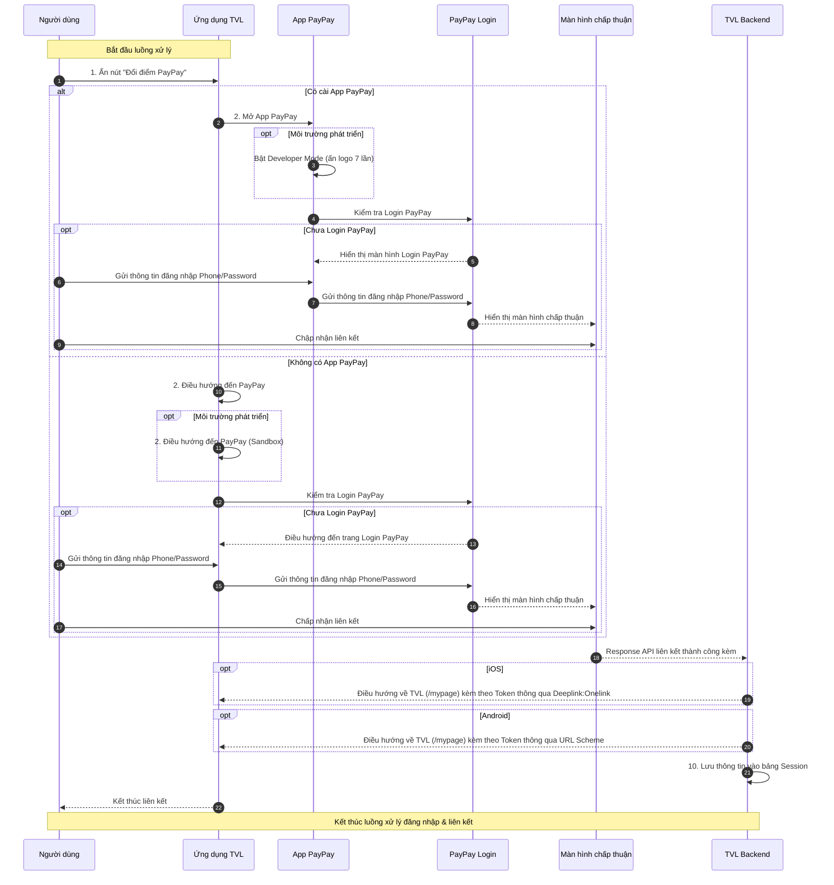

```yaml
 Tiêu đề: Tài liệu kỹ thuật về luồng đăng nhập qua PayPay trên ứng dụng TVL (iOS & Android)
 Mô tả: Tài liệu này trình bày chi tiết luồng xử lý đăng nhập vào tài khoản PayPay từ ứng ứng dụng TVL (iOS & Android) nhằm phục vụ việc liên kết tài khoản TVL và PayPay thông qua ứng dụng PayPay hoặc trình duyệt. Đồng thời mô tả cách bật Developer Mode để phục vụ môi trường kiểm thử.

 tags:
  - type:doc
  - feature:points_exchange/paypay/login
  - domain:mobile
  - created_by: nhuthq@zigexn.vn
  - created_at: 2025-04-25
----
```

## Purpose:

- Tài liệu này nhằm mục đích cung cấp mô tả kỹ thuật chi tiết liên quan đến quá trình đăng nhập tài khoản PayPay trên **ứng dụng TVL** (iOS & Android) – một bước trung gian quan trọng trong quá trình liên kết tài khoản giữa TVL App và PayPay, từ đó cho phép người dùng thực hiện tính năng chuyển đổi điểm.

## Overview:

- Việc đăng nhập PayPay là bước trung gian quan trọng trước khi người dùng có thể thực hiện chuyển đổi điểm từ **ứng dụng TVL** (iOS & Android) sang ví PayPay, và đảm bảo rằng các tài khoản được liên kết một cách an toàn và hợp lệ.
- Điều kiện:
  - Người dùng phải có tài khoản TVL và tài khoản PayPay đã được tạo sẵn từ trước.
- Nền tảng:
  - Ứng dụng TVL (iOS, Android)
  - Ứng dụng PayPay (iOS, Android)
  - WebView của ứng dụng TVL (trong trường hợp không cài PayPay App)
- Mục tiêu:
  - Cho phép người dùng đăng nhập vào tài khoản PayPay của họ để thực hiện liên kết với tài khoản TVL.
  - Hỗ trợ chế độ phát triển (Developer Mode) dành cho môi trường kiểm thử.
- Người dùng có thể thực hiện login vào PayPay qua hai hình thức tùy theo thiết bị:
  - **App PayPay (nếu đã cài)**: Mở app PayPay để đăng nhập và chấp thuận liên kết.
  - **WebView (nếu không cài app PayPay)**: Mở WebView trong ứng dụng TVL để đăng nhập và thực hiện liên kết thay cho trình duyệt.

## Flow:

- Luồng xử lý chính bao gồm các bước sau:

- **Bước 1:** Người dùng mở ứng dụng TVL và nhấn nút "Đổi điểm PayPay" trên màn hình MyPage.
- **Bước 2:** Ứng dụng kiểm tra thiết bị có cài đặt App PayPay hay không:

  - **Trường hợp 1:** Có cài đặt App PayPay
    - TVL App thực hiện mở App PayPay thông qua URLScheme.
    - Nếu là môi trường phát triển, yêu cầu người dùng bật Developer Mode (ấn logo PayPay 7 lần).
    - App PayPay gọi kiểm tra trạng thái đăng nhập:
      - Nếu chưa đăng nhập:
        - Hiển thị màn hình đăng nhập.
        - Người dùng nhập số điện thoại và mật khẩu để đăng nhập.
    - Sau khi đăng nhập thành công, hệ thống hiển thị màn hình chấp thuận liên kết tài khoản với TVL.
    - Người dùng nhấn “Chấp nhận liên kết”.
  - **Trường hợp 2:** Không có App PayPay
    - TVL App mở trang đăng nhập PayPay thông qua WebView nội bộ.
    - Nếu là môi trường phát triển, điều hướng đến domain sandbox: https://stg-www.sandbox.paypay.ne.jp/.
    - Gọi kiểm tra trạng thái đăng nhập:
      - Nếu chưa đăng nhập:
        - Hiển thị màn hình đăng nhập trong WebView.
        - Người dùng nhập số điện thoại và mật khẩu.
      - Sau khi đăng nhập thành công, hiển thị màn hình chấp thuận liên kết.
      - Người dùng nhấn “Chấp nhận liên kết”.

- **Bước 3** Sau khi người dùng chấp thuận liên kết, hệ thống PayPay thực hiện:

  - Gửi response liên kết thành công đến TVL Backend, kèm theo Authorization Code.

- **Bước 4:** Tùy theo nền tảng thiết bị, backend điều hướng về ứng dụng TVL:

  - Với iOS: sử dụng Deeplink Onelink để điều hướng về màn hình /mypage của TVL App, kèm theo Token liên kết.
  - Với Android: sử dụng URLScheme để điều hướng về /mypage, kèm theo Token.

- **Bước 5** Sau khi nhận được Authorization Code, TVL Backend thực hiện:

  - Gọi API PayPay để đổi Authorization Code lấy Access Token.
  - Nhận về Access Token từ PayPay.
  - Lưu Access Token và thông tin tài khoản người dùng vào bảng Session của hệ thống.

- **Bước 6** TVL App hiển thị màn hình chọn số points để đổi



- Chú thích:

  - **Access Token** chỉ có giá trị hiệu lực trong vòng 15 phút, nếu quá hạn sẽ phải thực hiện lại luồng
  - **TVLBE** Xử lý khởi tạo Deeplink Oneline ở dòng [code này](https://github.com/apple-world/tvl_nuxt_web2/blob/da74f773b9634f634cf5e6457bfec2c615479b4f/components/points_exchange/paypay/PaypaySelectBox.vue#L56-L68)
  - **Deeplink Onelink** được cung cấp bởi dịch vụ Appsflyer

- TVL Backend giờ đóng vai trò:

  - Nhận callback từ PayPay chứa các thông tin sau đó lưu các thông tin đó vào bảng paypay_sessions:
  - Các thông tin bao gồm:

    - userAuthorizationId
    - referenceId
    - nonce

  - Trả kết quả về lại frontend.

## API:

- **Lưu ý:** Trong luồng đăng nhập PayPay, không có API từ phía TVL trực tiếp xử lý việc login, vì tất cả việc xác thực đều thực hiện trên nền tảng PayPay. Tuy nhiên, một số thông tin kỹ thuật liên quan có thể được sử dụng từ tài liệu chính thức của PayPay:

- **PayPay**
  | Endpoint | Method | Description |
  | ---------------------- | ------ | ---------------------------------------------------------- |
  | `/paypay/authorize` | GET | Khởi tạo luồng đăng nhập PayPay, redirect đến URL xác thực |
  | `/paypay/callback` | POST | Nhận callback từ PayPay sau khi người dùng xác thực |
  | `/paypay/token` | POST | Đổi authorization code lấy access token từ PayPay |
  | `/paypay/link-account` | POST | Lưu thông tin tài khoản PayPay vào bảng Session của TVL |

  | Thông tin                     | Mô tả                                                                                                              |
  | ----------------------------- | ------------------------------------------------------------------------------------------------------------------ |
  | **URL môi trường Production** | `https://www.paypay.ne.jp/opa/authorize`                                                                           |
  | **URL môi trường Sandbox**    | `https://stg-www.sandbox.paypay.ne.jp/`                                                                            |
  | **Tài liệu chính thức**       | [PayPay Official Docs](https://www.paypay.ne.jp/opa/doc/v1.0/account_link.html#section/Acquire-user-authorization) |

- **Appsflyer**
  | Thông tin | Mô tả |
  | ----------------------------- | ------------------------------------------------------------------------------------------------------------------ |
  | **URL môi trường Production** | `https://travelist.onelink.me/VSoR` |
  | **URL môi trường Sandbox** | `https://travelist.onelink.me/VSoR` |
  | **Tài liệu chính thức** | [Appsflyer Onelink](https://support.appsflyer.com/hc/vi/articles/208874366-Liên-kết-và-trải-nghiệm-OneLink) |

- Developer Mode:
  | Nền tảng | Cách bật chế độ |
  |---------------------|----------------------------------------------------------------------------------|
  | **Ứng dụng PayPay** | Ấn 7 lần vào logo PayPay ở góc trái màn hình đăng nhập. Chọn `Log in with PayPay for Developers account`. |
  | **TVL App WebView** | Truy cập vào liên kết: `https://stg-www.sandbox.paypay.ne.jp/` |
