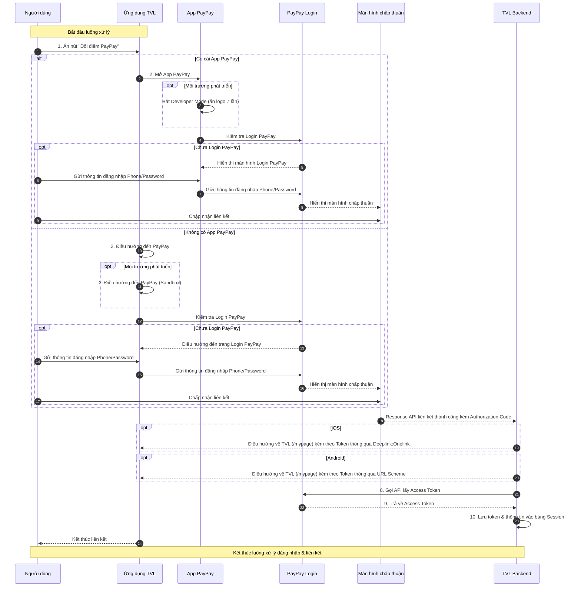

```yaml
 Tiêu đề: Tài liệu kỹ thuật về luồng đăng nhập qua PayPay trên ứng dụng TVL (iOS & Android)
 Mô tả: Tài liệu này trình bày chi tiết luồng xử lý đăng nhập vào tài khoản PayPay từ ứng ứng dụng TVL (iOS & Android) nhằm phục vụ việc liên kết tài khoản TVL và PayPay thông qua ứng dụng PayPay hoặc trình duyệt. Đồng thời mô tả cách bật Developer Mode để phục vụ môi trường kiểm thử.

 tags:
  - type:doc
  - feature:points_exchange/paypay/login
  - domain:mobile
  - created_by: nhuthq@zigexn.vn
  - created_at: 2025-04-25
----
```

## Purpose:

- Tài liệu này nhằm mục đích cung cấp mô tả kỹ thuật chi tiết liên quan đến quá trình đăng nhập tài khoản PayPay trên **ứng dụng TVL** (iOS & Android) – một bước trung gian quan trọng trong quá trình liên kết tài khoản giữa TVL App và PayPay, từ đó cho phép người dùng thực hiện tính năng chuyển đổi điểm.

## Overview:

- Việc đăng nhập PayPay là bước trung gian quan trọng trước khi người dùng có thể thực hiện chuyển đổi điểm từ **ứng dụng TVL** (iOS & Android) sang ví PayPay, và đảm bảo rằng các tài khoản được liên kết một cách an toàn và hợp lệ.
- Mục tiêu:
  - Cho phép người dùng đăng nhập vào tài khoản PayPay của họ để thực hiện liên kết với tài khoản TVL.
  - Hỗ trợ chế độ phát triển (Developer Mode) dành cho môi trường kiểm thử.
- Điều kiện:
  - Người dùng phải có tài khoản TVL và tài khoản PayPay đã được tạo sẵn từ trước.
- Nền tảng:
  - Ứng dụng TVL (iOS, Android)
  - Ứng dụng PayPay (iOS, Android)
  - WebView của ứng dụng TVL (trong trường hợp không cài PayPay App)
- Người dùng có thể thực hiện login vào PayPay qua hai hình thức tùy theo thiết bị:
  - **App PayPay (nếu đã cài)**: Mở app PayPay để đăng nhập và chấp thuận liên kết.
  - **WebView (nếu không cài app PayPay)**: Mở WebView trong ứng dụng TVL để đăng nhập và thực hiện liên kết thay cho trình duyệt.

## Flow:

- Luồng xử lý chính bao gồm các bước sau:

- **Bước 1:** Người dùng mở ứng dụng TVL và nhấn nút "Đổi điểm PayPay" trên màn hình MyPage.
- **Bước 2:** Ứng dụng TVL kiểm tra điều kiện:
  - Nếu thiết bị có App PayPay:
    - Mở App PayPay.
  - Nếu thiết bị không có App PayPay:
    - Mở trang đăng nhập PayPay trong WebView của TVL App.
    - Trong môi trường phát triển: điều hướng đến domain sandbox https://stg-www.sandbox.paypay.ne.jp/.
- **Bước 3:** Ứng dụng (App PayPay hoặc WebView) gọi luồng đăng nhập PayPay.
  - Nếu đã đăng nhập trước đó, hệ thống sẽ bỏ qua bước đăng nhập và chuyển thẳng đến màn hình xác nhận liên kết.
  - Nếu chưa đăng nhập:
    - Hiển thị màn hình đăng nhập.
    - Người dùng nhập số điện thoại & mật khẩu.
    - Gửi thông tin xác thực đến hệ thống PayPay.
- **Bước 4:** Sau khi xác thực thành công, hiển thị màn hình chấp thuận liên kết tài khoản PayPay với TVL.
  - Người dùng nhấn đồng ý liên kết.
- **Bước 5:** Hệ thống PayPay redirect trở lại ứng dụng TVL bằng URLScheme, kèm theo Authorization Code.
- **Bước 6:** TVL App gửi Authorization Code đến TVL Backend.
- **Bước 7:** TVL Backend gọi PayPay API để:
  - Đổi Authorization Code lấy Access Token.
- **Bước 8:** TVL Backend lưu Access Token và thông tin liên kết vào bảng Session.
- **Bước 9:** Ứng dụng TVL hiển thị thông báo liên kết thành công đến người dùng.
- **Kết thúc**



- TVL Backend giờ đóng vai trò:
  - Nhận callback từ PayPay chứa authorization code.
  - Gọi PayPay token API để đổi lấy access token và thông tin người dùng.
  - Lưu thông tin vào bảng Session để đánh dấu trạng thái login.
  - Trả kết quả về lại frontend.
  - Access Token chỉ có giá trị hiệu lực trong vòng 15 phút, nếu quá hạn sẽ phải thực hiện lại luồng

## API:

| Endpoint               | Method | Description                                                |
| ---------------------- | ------ | ---------------------------------------------------------- |
| `/paypay/authorize`    | GET    | Khởi tạo luồng đăng nhập PayPay, redirect đến URL xác thực |
| `/paypay/callback`     | POST   | Nhận callback từ PayPay sau khi người dùng xác thực        |
| `/paypay/token`        | POST   | Đổi authorization code lấy access token từ PayPay          |
| `/paypay/link-account` | POST   | Lưu thông tin tài khoản PayPay vào bảng Session của TVL    |

- **Lưu ý:** Trong luồng đăng nhập PayPay, không có API từ phía TVL trực tiếp xử lý việc login, vì tất cả việc xác thực đều thực hiện trên nền tảng PayPay. Tuy nhiên, một số thông tin kỹ thuật liên quan có thể được sử dụng từ tài liệu chính thức của PayPay:
  | Thông tin | Mô tả |
  |----------------------------|----------------------------------------------------------------------|
  | **URL môi trường Production** | `https://www.paypay.ne.jp/opa/authorize` |
  | **URL môi trường Sandbox** | `https://stg-www.sandbox.paypay.ne.jp/` |
  | **Tài liệu chính thức** | [PayPay Official Docs](https://www.paypay.ne.jp/opa/doc/v1.0/account_link.html#section/Acquire-user-authorization) |
  | **OAuth Flow** | Authorization Code Grant |

- Developer Mode:
  | Nền tảng | Cách bật chế độ |
  |---------------------|----------------------------------------------------------------------------------|
  | **Ứng dụng PayPay** | Ấn 7 lần vào logo PayPay ở góc trái màn hình đăng nhập. Chọn `Log in with PayPay for Developers account`. |
  | **TVL App WebView** | Truy cập vào liên kết: `https://stg-www.sandbox.paypay.ne.jp/` |
