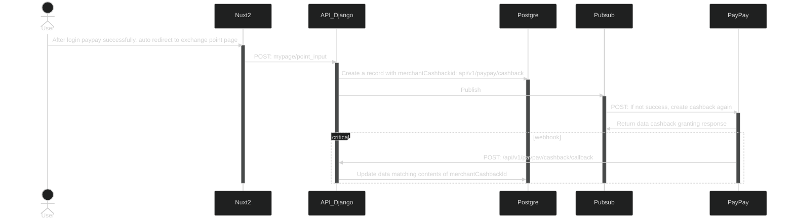
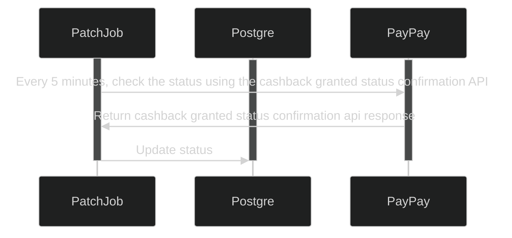

```yaml
 tags:
  - type:doc
  - feature:points_exchange/paypay
  - domain:shared
  - created_by: nhuthq@zigexn.vn
  - created_at: 2025-04-23
----
```

## Purpose:

- This document describes the Sequence Diagrams related to the point conversion flow between TVL and PayPay.

## Overview:

## Flow:

- Login with paypay to authenticate user to able to exchange points:



- Exchange points from Travelist to Paypay:


- Check status cashback granted (run command every 5 minutes)



- Revert cashback from paypay to TVL:

- Check status cashback cancellation (run command every 5 minutes)

- Store the transaction history data files in PayPay in s3 and view data

## API: Endpoint liên quan

- Login with paypay to authenticate user to able to exchange points:
  | No | Method | Enpoint |
  | --- | ------ | ------------------------------------------------ |
  | 1 | POST | /mypage/points_exchange |
  | 2 | POST | /api/v1/paypay/sessions |
  | 3 | POST | https://stg-api.sandbox.paypay.ne.jp/v2/cashback |
  | 4 | PUT | api/v1/paypay/update_session |
  | 5 | POST | /api/v1/paypay/sessions/callback |

- Exchange points from Travelist to Paypay:
  | No | Method | Enpoint |
  | --- | ------ | ------------------------------------------------ |
  | 1 | | |
  | 2 | | |
  | 3 | | |
  | 4 | | |
  | 5 | | |

- Check status cashback granted (run command every 5 minutes)
  | No | Method | Enpoint |
  | --- | ------ | ------------------------------------------------ |
  | 1 | | |
  | 2 | | |
  | 3 | | |
  | 4 | | |
  | 5 | | |

- Revert cashback from paypay to TVL:
  | No | Method | Enpoint |
  | --- | ------ | ------------------------------------------------ |
  | 1 | | |
  | 2 | | |
  | 3 | | |
  | 4 | | |
  | 5 | | |

- Check status cashback cancellation (run command every 5 minutes)
  | No | Method | Enpoint |
  | --- | ------ | ------------------------------------------------ |
  | 1 | | |
  | 2 | | |
  | 3 | | |
  | 4 | | |
  | 5 | | |

- Store the transaction history data files in PayPay in s3 and view data
  | No | Method | Enpoint |
  | --- | ------ | ------------------------------------------------ |
  | 1 | | |
  | 2 | | |
  | 3 | | |
  | 4 | | |
  | 5 | | |
