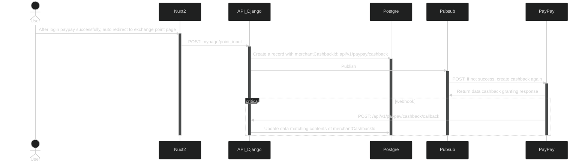

```yaml
 tags:
  - type:spec
  - feature:points_exchange/paypay
  - domain:shared
  - created_by: nhuthq@zigexn.vn
  - created_at: 2025-04-22
----
```

## Overview

- Conditions:
  1. Required at least 1 booking during in 1 year
  2. Required have points
- Allows member to exchange points awarded from tvl app to paypay wallet.

## Structure (integrate with paypay)

### Login with paypay to authenticate user to able to exchange points



### Exchange points from Travelist to Paypay

- https://www.mermaidchart.com/raw/7deaec01-c839-44b1-83cb-e6a6aca06a8d?theme=dark&version=v0.1&format=svg

### Check status cashback granted (run command every 5 minutes)

- https://www.mermaidchart.com/raw/8ea12b1c-d049-4453-8c6f-34f569faee1e?theme=dark&version=v0.1&format=svg

### Revert cashback from paypay to TVL

### Check status cashback cancellation (run command every 5 minutes)

### Store the transaction history data files in PayPay in s3 and view data

## Database and ERD diagram

### Table `paypay_sessions`

### Table `paypay_cashback_request`

### Table `paypay_reverse_cashback_request`

### Table `paypay_transaction_file_logs`

## ECS on Aws

- Cluster `sand-cluster01` :

  - Service: [sand-kokunai-django-give-cashback-worker](https://ap-northeast-1.console.aws.amazon.com/ecs/v2/clusters/sand-cluster01/services/sand-kokunai-django-give-cashback-worker/health?region=ap-northeast-1)
  - **Scheduled tasks:** [sand_check_status_paypay_cashback](https://ap-northeast-1.console.aws.amazon.com/ecs/v2/clusters/sand-cluster01/scheduled-tasks/sand_check_status_paypay_cashback?region=ap-northeast-1)

- Cluster **`prod-cluster01` :**
  - Service: [prod-kokunai-django-give-cashback-worker](https://ap-northeast-1.console.aws.amazon.com/ecs/v2/clusters/prod-cluster01/services/prod-kokunai-django-give-cashback-worker/health?region=ap-northeast-1)
  - **Scheduled tasks:** [prod_check_status_paypay_cashback](https://ap-northeast-1.console.aws.amazon.com/ecs/v2/clusters/prod-cluster01/scheduled-tasks/prod_check_status_paypay_cashback?region=ap-northeast-1)

<aside>
📒 *** Provide a detailed description of the functionality ***
- {sand/prod}-kokunai-django-give-cashback-worker: Use Pub/Sub to handle the API call for converting points from TVL to PayPay (The job will be refresh and run again every 00:00 every day).
- {sand/prod}-check_status_paypay_cashback: check status detail casback when callback doesn't work(run every 5 minutes)
</aside>

## How To Deploy

- Deploy api_django
- Refresh worker {sand/prod}-kokunai-django-give-cashback-worker
- Refresh worker {sand/prod}-check_status_paypay_cashback

## Download Finance Point Report

(Ex: [ポイントデータ\_20240108174016.xls](https://github.com/apple-world/tvl_api_django/files/13857892/_20240108174016.xls))

- Go to url: https://sand.travelist.work/admin2/ops/finance/point/
- Select month and year then press download file excel
- Open file excel
  Sheet 集計
  
  Line 7-A: Total number of paypay points used to redeem on the website
  Line 8-A: Total number of paypay points used to redeem on the App
  Sheet 詳細記録
  
  Column J: Record the converted Points for Points received from ticket purchases (purchase.exchange_use_points)
  Column K: Record the converted Points for Points received from new member registration (promotion.exchange_use_points)

## How To Test Exchange Points From TVL to Paypay - Sand

### Create PayPay Account:

- Go to link: https://developer.paypay.ne.jp/account/signin
  
- Register an account and then log in
  
- Setting webhook and callback: https://developer.paypay.ne.jp/settings
  

### Step 1: [\*Go to my page](https://sand.travelist.work/mypage/) and\* [click](https://sand.travelist.work/mypage/points_exchange/menu) ポイント交換


### Step 2: Click section PayPay ポイント


**_Note: Point conversion rate_**

- PC and SP: 100pt → 50 pt.
- APP Native: 100pt → 100pt

### Step 3: Login to PayPay


**_Note: Check Type Of Device:_**

- Account: `080-7862-6960`
- Password: `wC6Pj9Bohx`

**_Note: Check Type Of Device:_**
After click section `PayPay ポイント, automatically open link to login paypay`.

- PC: Redirect page login paypay on PC’s brower
- SP: Open app paypay to login on smartphone
- APP: Open app paypay to login on smartphone

### Step 4: After login paypay, automatically redirect to the page (**[points_exchange/menu](https://sand.travelist.work/mypage/points_exchange/menu)**) and callback api (/api/v1/paypay/sessions/update_session)

- 

### Step 5: After loading the icon, automatically redirect to the page ([point_input](https://sand.travelist.work/mypage/point_input)) to exchange point

- 

Enter the number of points from the keyboard or select +100 or + 500 points or 1000 points or 5000 points to exchange
