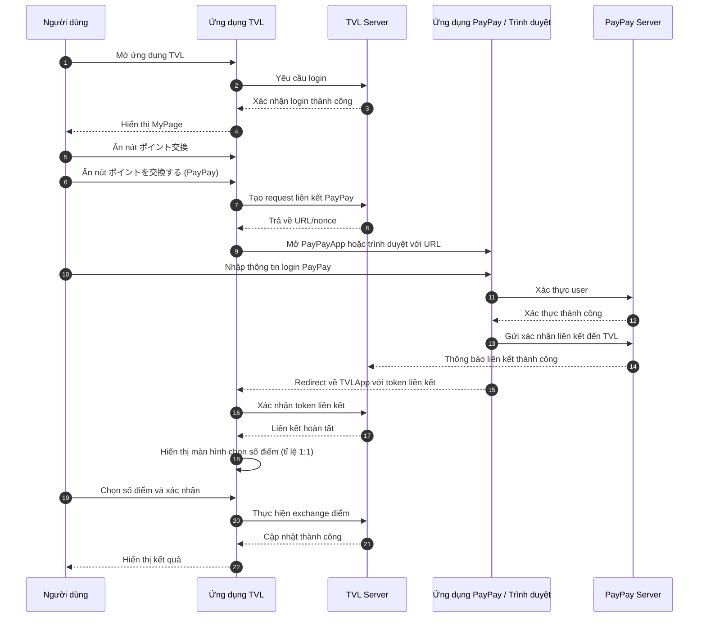

```yaml
 Tiều đề: Tính năng đổi điểm từ TVL App sang PayPay
 Mô tả: Tài liệu này trình bày chi tiết sơ đồ Sequence Diagram cùng luồng xử lý chính để thực hiện việc liên kết và trao đổi điểm thưởng giữa ứng dụng TVL và dịch vụ PayPay, bao gồm từ bước khởi tạo yêu cầu, xác thực người dùng trên cả hai hệ thống đến quá trình xác nhận và hoàn tất giao dịch với tỉ lệ quy đổi 1:1.
 tags:
  - type:spec
  - feature:points_exchange/paypay
  - domain:shared
  - created_by: nhuthq@zigexn.vn
  - created_at: 2025-04-22
----
```

## Mục tiêu:

- Cho phép người dùng thực hiện việc chuyển đổi số điểm points từ ứng dụng TVL sang ví PayPay.
- Nếu người dùng thoã điều kiện bên dưới thì được phép đổi nếu không thoã điều kiện thì không được phép đổi.
- Điều kiện bao gồm:
  1. Phải có ít nhất 01 lần thành toán đặt vé máy bay thành công trong vòng 1 năm.
  2. Phải có số điểm points có trong tài khoản TVL:
- Người dùng có thể kiếm điểm points thông qua các tính năng sau:
  1. Thực hiện tạo tài khoản và đăng nhập thành công vào ứng dụng TVL.
  2. Thực hiện hoàn tất việc mua vé máy bay.
  3. Thực hiện việc đánh giá.
- Trang quản trị có thể dùng để thống kê và xuất báo cáo lượt đổi cũng như số điểm đổi trên từng người dùng.

## Phạm vi:

- **Người dùng:** Tất cả người dùng thoã điều kiện phía trên
- **Nền tảng:** Ứng dụng (iOS & Android)
- **Môi trường:** Production và Sand
- **Tỉ lệ đổi điểm:** 1:1
  - Ví dụ: 100 điểm TVL có thể đổi sang 100 điểm PayPay

## Luồng xử lý:

- Luồng xử lý chính sẽ bao gồm các bước sau:

  - **Bước 1.** Người dùng mở ứng dụng TVL.
  - **Bước 2.** Mở sang trang MyPage và thực hiện đăng nhập tài khoản TVL thành công.
  - **Bước 3.** Người dùng ấn vào nút ポイント交換 (Point Exchange).
  - **Bước 4.** Kế tiếp ấn vào nút ポイントを交換する - (PayPay) (Exchange Points - PayPay).
  - **Bước 5.** Người dùng cần phải đăng nhập vào tài khoản PayPay cá nhân (If the PayPay app is installed, it will open the app; otherwise, it will open the browser).
  - **Bước 6.** Thực hiện việc chấp nhập liên kết tài khoản giữa TVl và PayPay.
  - **Bước 7.** Liên kết thành công và trở về ứng dụng TVL.
  - **Bước 8.** Ứng dụng mở trang đổi điểm và cho phép chọn số điểm mà người dùng muốn qui đổi với tỉ lệ là 1:1.

## Sequence Diagram: Chuyển đổi điểm TVL ↔ PayPay



- Giải thích các Actor
  - **Người dùng (User):** Là cá nhân sử dụng ứng dụng TVL để thực hiện chuyển đổi điểm. Người dùng phải đăng nhập cả tài khoản TVL và PayPay để liên kết và trao đổi điểm.
  - **Ứng dụng TVL (TVLApp):** Giao diện phía client mà người dùng thao tác. Chịu trách nhiệm điều hướng màn hình, hiển thị nút Point Exchange và tích hợp PayPay thông qua URL/SDK.
  - **TVL Server (TVLServer):** Backend của TVL, xử lý các request đăng nhập, phát sinh request liên kết PayPay, xác nhận token liên kết và thực hiện trao đổi điểm.
  - **Ứng dụng PayPay / Trình duyệt (PayPayApp):** Phần mềm PayPay trên thiết bị hoặc trình duyệt web được mở khi người dùng chọn liên kết PayPay. Chịu trách nhiệm xác thực người dùng và thu thập xác nhận liên kết.
  - **PayPay Server (PayPayServer):** Backend của PayPay, nhận yêu cầu xác thực login, xử lý chấp nhận liên kết và trả về kết quả về TVL Server.

## Out of Scope:

- Dưới đây là một số điểm không nằm trong phạm vi xử lý của tính năng này, hãy lưu ý:
  - Quản lý tài khoản TVL:
    - Đăng ký tài khoản mới, thay đổi mật khẩu, hoặc cập nhật thông tin cá nhân của người dùng.
    - Xử lý trường hợp quên mật khẩu hoặc xác thực hai lớp (2FA).
  - Quản lý ví PayPay:
    - Nạp tiền vào ví PayPay, rút tiền về ngân hàng, xem lịch sử giao dịch chi tiết trên PayPay.
    - Thay đổi cài đặt bảo mật hoặc thông tin cá nhân trên ứng dụng PayPay.
  - Xử lý lỗi mạng / server chung:
    - Cơ chế retry tự động khi mất kết nối internet toàn cục (ngoài việc hiển thị thông báo lỗi cơ bản).
    - Giải pháp fallback nếu TVL Server hoặc PayPay Server bị downtime kéo dài.
  - Hỗ trợ đa nền tảng bao gồm SP và PC.
  - Hỗ trợ việc phân tích các giao dịch.
  - Tự động gia hạn token PayPay khi hết hạn mà không qua flow UI.
  - Lưu session lâu dài hoặc “Remember me” cho PayPay.
  - Các phương thức thanh toán khác.
  - Tích hợp với ví điện tử/ngân hàng khác ngoài PayPay.
  - Chuyển điểm sang Gift Card, voucher, hoặc partner khác.

## References:

- [Sequence Diagrams](./[DOC]_sequence_diagrams.md)
- [Database and ERD diagrams](./[DOC]_table_and_ER_diagram.md)
- [How to deploy](./[DOC]_how_to_deploy.md)
- [How to download the point finance report](./[SPEC]_how_to_download_report.md)
- [How to test funtion exchange points from TVL to Paypay (on Sand)](./[SPEC]_how_to_test.md)
