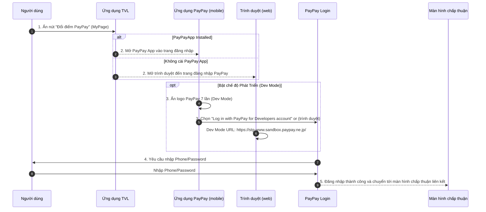

```yaml
 Tiêu đề: Đăng nhập tài khoản PayPay
 Mô tả: Tài liệu này trình bày luồng xử lý đăng nhập vào tài khoản PayPay để thực hiện việc liên kết tài khoản TVL và tài khoản PayPay thông qua ứng dụng PayPay hoặc trình duyệt.
 tags:
  - type:spec
  - feature:points_exchange/paypay/login
  - domain:mobile
  - created_by: nhuthq@zigexn.vn
  - created_at: 2025-04-24
----
```

## Mục tiêu:

- Mô tả luồng đăng nhập tài khoản PayPay cá nhân của người dùng, mục tiêu liên để kết tài khoản TVL và tài khoản PayPay.
- Điều kiện:
  - Người dùng phải có tài khoản PayPay cá nhân đã tạo trước đó

## Phạm vi:

- **Người dùng:** Tất cả người dùng có tài khoản PayPay
- **Nền tảng:** Browser, Ứng dụng PayPay (iOS & Android)
- **Môi trường:** Production và Sand

## Luồng xử lý:

- Luồng xử lý chính sẽ bao gồm các bước sau:

  - **Bước 1.** Người dùng ấn vào nút đổi điểm PayPay trên ứng dụng TVL ở trang MyPage.
  - **Bước 2.** Nếu thiêt bị có cài đặt ứng dụng PayPay thì sẽ mở ứng dụng PayPay, nếu không sẽ mở trình duyệt, sau đó đến trang đặng nhập tài khoản PayPay.
  - **Bước 3.** Để bật chế độ Phát Triển thì ấn vào logo PayPay 7 lần liên tiếp ở góc trái trên màn hình của ứng dụng PayPay (chỉ áp dụng cho ứng dụng PayPay), sau đó ấn vào nút "Log in with PayPay for Developers account".
  - **Bước 4.** Đăng nhập tài khoản PayPay cá nhân (hoặc bằng tài khoản kiểm thử) bằng Phone/Password.
  - **Bước 5.** Đăng nhập thành công, ứng dụng tự động di chuyển đến màn hình yêu cầu chấp thuận liên kết tài khoản.

- Chú thích:
  - Trong quá trình phát triển/kiểm thử nên bật chế độ Phát Triển và sử dụng tài khoản được cấp trước đó để không bị ảnh hưởng.
  - Chế độ Phát Triển có hỗ trợ trên cả nền tảng ứng dụng PayPay và trình duyệt/
  - ## Cách thức bật chế độ Phát Triển
    - Ứng dụng PayPay: Thao tác như **Bước 3**.
    - Trình duyệt: Liên kết có tên miền: https://stg-www.sandbox.paypay.ne.jp/

## Sequence Diagram: Chuyển đổi điểm TVL ↔ PayPay



- Giải thích các Actor
  - **Người dùng (User):** Khách hàng sử dụng ứng dụng TVL trên thiết bị di động.
  - **Ứng dụng TVL (TVLApp):** Ứng dụng TVL, nơi người dùng khởi tạo yêu cầu đổi điểm sang PayPay.
  - **Ứng dụng PayPay (mobile) (PayPayApp):** Ứng dụng PayPay cài đặt trên thiết bị, chỉ tương tác khi đã được cài sẵn.
  - **Trình duyệt (Browser):** Mở trang web PayPay khi không cài sẵn ứng dụng.
  - **PayPay Login (PayPayLogin):** Module/flow xử lý đăng nhập PayPay (cả mobile và web).
  - **Màn hình chấp thuận (Consent):** Giao diện yêu cầu người dùng đồng ý liên kết tài khoản.

## Out of Scope:

- Dưới đây là một số điểm không nằm trong phạm vi xử lý của tính năng này, hãy lưu ý:
  - Quản lý số dư và giao dịch PayPay chi tiết
    - Xem lịch sử giao dịch trên PayPay.
    - Nạp/rút tiền hoặc đổi điểm sang tiền mặt.
  - Xác thực bảo mật mở rộng
    - Thực hiện xác thực hai yếu tố (2FA) như OTP qua SMS hoặc email.
    - Sinh và quản lý mã QR PayPay.
  - Quản lý tài khoản người dùng TVL
    - Đăng ký, đăng nhập, hoặc thay đổi thông tin tài khoản TVL.
    - Đồng bộ điểm TVL với các hệ thống khác ngoài PayPay.
  - Tương tác với các cổng thanh toán khác
    - Đổi điểm sang các ví điện tử khác (Momo, ZaloPay, AirPay…).
    - Thanh toán trực tiếp qua cổng ngân hàng.
  - Xử lý lỗi mạng/đứt kết nối
    - Cơ chế retry, hiển thị thông báo lỗi khi mất kết nối Internet.
    - Quản lý trạng thái ngoại tuyến.
  - Tối ưu UI/UX và analytics
  - Thu thập dữ liệu phân tích hành vi người dùng trong flow này. -
    - A/B testing hay tối ưu giao diện chuyển điểm.
  - Xử lý đa ngôn ngữ và quốc tế hóa
    - Hiển thị ngôn ngữ khác ngoài tiếng Việt/tiếng Anh.
    - Định dạng ngày giờ, tiền tệ theo locale khác.
  - Quản lý phiên làm việc và bảo mật token
    - Token refresh, hết hạn session, logout tự động.
  - Các tác vụ hậu xử lý sau khi liên kết thành công
    - Gửi email hoặc thông báo đẩy (push notification) xác nhận.
  - Đồng bộ lịch sử đổi điểm lên hệ thống CRM.
    - Test tự động và CI/CD
    - Viết script unit test, e2e test cho flow đổi điểm.
    - Thiết lập pipeline CI/CD để deploy flow này.

## References:

- [Points Exchange PayPay](./[SPEC]_points_exchange-paypay.md)
- [PayPay Docuemtn](https://www.paypay.ne.jp/opa/doc/v1.0/account_link.html#section/Acquire-user-authorization)
