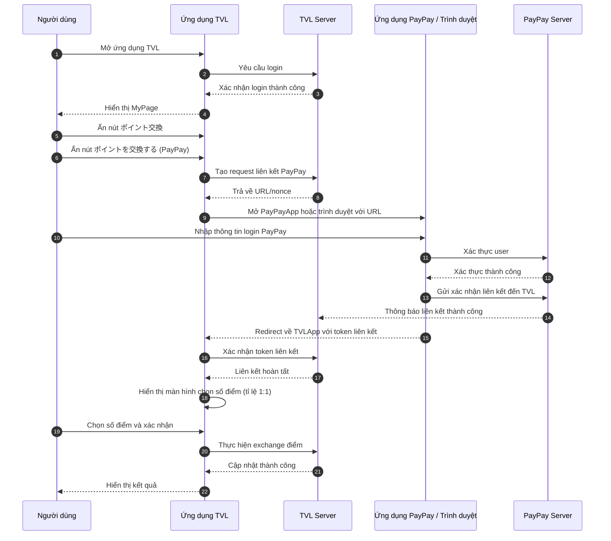

```yaml
 Tiêu đề: Tính năng đổi điểm từ TVL App sang PayPay
 Mô tả: Tài liệu này trình bày chi tiết sơ đồ Sequence Diagram cùng luồng xử lý chính để thực hiện việc liên kết và trao đổi điểm thưởng giữa ứng dụng TVL và dịch vụ PayPay, bao gồm từ bước khởi tạo yêu cầu, xác thực người dùng trên cả hai hệ thống đến quá trình xác nhận và hoàn tất giao dịch với tỉ lệ quy đổi 1:1.
 tags:
  - type:spec
  - feature:points_exchange/paypay
  - domain:shared
  - created_by: nhuthq@zigexn.vn
  - created_at: 2025-04-22
----
```

## Mục tiêu:

- Cho phép người dùng thực hiện việc chuyển đổi số điểm từ ứng dụng TVL sang ví PayPay.
- Nếu thoã điều kiện thì được thực hiện chuyển đổi, nếu không thoã thì không được thực hiện.
- Điều kiện:
  - Người dùng phải có ít nhất 01 lần thanh toán mua vé bay thành công trong vòng 1 năm.
  - Người dùng phải có số điểm > 0.

## Phạm vi:

- **Người dùng:** Tất cả người dùng thoã điều kiện
- **Nền tảng:** Ứng dụng (iOS & Android)
- **Môi trường:** Production và Sand
- **Tỉ lệ đổi điểm:** 1:1
  - Ví dụ: 100 điểm TVL có thể đổi sang 100 điểm PayPay

## Luồng xử lý:

- Luồng xử lý chính sẽ bao gồm các bước sau:

  - **Bước 1.** Người dùng mở ứng dụng TVL.
  - **Bước 2.** Mở sang trang MyPage và thực hiện đăng nhập tài khoản TVL thành công.
  - **Bước 3.** Người dùng ấn vào nút ポイント交換 (Point Exchange).
  - **Bước 4.** Kế tiếp ấn vào nút ポイントを交換する - (PayPay) (Exchange Points - PayPay).
  - **Bước 5.** Người dùng cần phải đăng nhập vào tài khoản PayPay cá nhân (If the PayPay app is installed, it will open the app; otherwise, it will open the browser).
  - **Bước 6.** Thực hiện việc chấp nhập liên kết tài khoản giữa TVL và PayPay. - [PayPay Login](./[SPEC]_paypay_login.md)
  - **Bước 7.** Liên kết thành công và trở về ứng dụng TVL.
  - **Bước 8.** Ứng dụng mở trang đổi điểm và cho phép chọn số điểm mà người dùng muốn qui đổi với tỉ lệ là 1:1.

## Sequence Diagram: Chuyển đổi điểm TVL ↔ PayPay



- Giải thích các Actor
  - **Người dùng (User):** Là cá nhân sử dụng ứng dụng TVL để thực hiện chuyển đổi điểm. Người dùng phải đăng nhập cả tài khoản TVL và PayPay để liên kết và đổi điểm.
  - **Ứng dụng TVL (TVLApp):** Giao diện phía client mà người dùng thao tác. Chịu trách nhiệm điều hướng màn hình, hiển thị nút Point Exchange và tích hợp PayPay thông qua URL/SDK.
  - **TVL Server (TVLServer):** Backend của TVL, xử lý các request đăng nhập, phát sinh request liên kết PayPay, xác nhận token liên kết và thực hiện đổi điểm.
  - **Ứng dụng PayPay / Trình duyệt (PayPayApp):** Phần mềm PayPay trên thiết bị hoặc trình duyệt web được mở khi người dùng chọn liên kết PayPay. Chịu trách nhiệm xác thực người dùng và thu thập xác nhận liên kết.
  - **PayPay Server (PayPayServer):** Backend của PayPay, nhận yêu cầu xác thực login, xử lý chấp nhận liên kết và trả về kết quả về TVL Server.

## Out of Scope:

- Updating...

## References:

- [DOC PayPay Login](./[DOC]_paypay_login.md)
- [SPEC PayPay Login](./[SPEC]_paypay_login.md)
